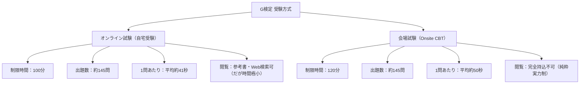
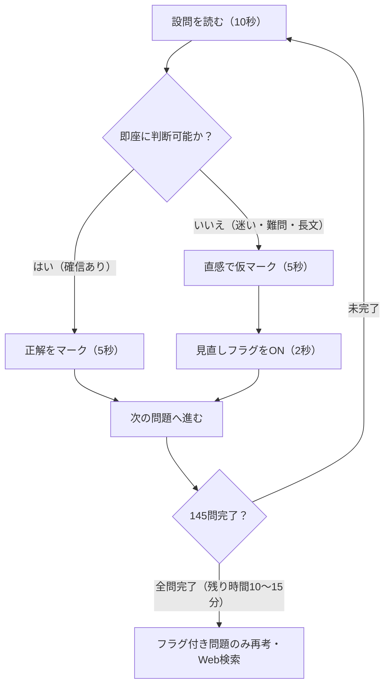
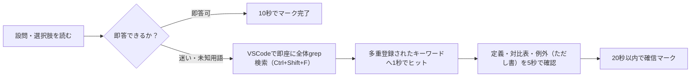

# 第0章：G検定 試験概要・合格戦略（2025-2026年新形式対応）

## 0-1. 試験形式の変遷と最新ルール（オンライン vs 会場CBT）（Q1..Q5）

日本ディープラーニング協会（JDLA）が主催する「G検定（Deep Learning for GENERAL）」は、ディープラーニングの基礎知識、事業活用力、関連法規・倫理を認定する国内最大級のAI検定です。2024年から2026年にかけて大きな制度改革が実施されました。

### オンライン試験と会場試験の徹底比較

| 項目 | オンライン試験（自宅等） | 会場試験（CBT） | 受験上の戦略ポイント |
| :--- | :--- | :--- | :--- |
| **試験時間** | **100分** | **120分** | オンラインは20分短縮されており時間管理が最重要 |
| **出題数** | **約145問**（多肢選択式） | **約145問**（多肢選択式） | 以前の「120分・190〜200問」から出題数は減少 |
| **1問の持ち時間** | **平均約41秒** | **平均約50秒** | 1問41秒は極めて短く、長考は即不合格を意味する |
| **参考資料閲覧** | **可能**（自作ノート・Web検索） | **完全禁止**（持込不可） | オンラインも「検索できる」と過信すると時間切れに陥る |
| **メモ・計算** | 自前のメモ用紙・筆記具可 | 会場配布のメモ用紙・ペン | CNNサイズや混同行列の手計算が必須 |
| **合格基準** | 正答率 約70%〜75%前後 | 同等（標準偏差調整あり） | 各分野で極端な足切りを作らないことが肝要 |

---

## 0-2. 合格を決定づけるタイムマネジメント戦略（1問41秒の壁）

100分で145問を解き切るための最も重要な戦術は**「フラグ（見直しマーク）の積極運用」**です。

### タイムマネジメントの鉄則（Q1〜Q10対応）
1. **1問に1分以上かけない**: 1問に3分費やすと、後半の配点が高い深層学習や法規問題が3〜4問未解答（タイムオーバー）で自動失点になります。
2. **空欄のまま次へ進まない**: 迷った場合でも、必ずその時点で最も確率の高そうな選択肢を仮マークしてからフラグを立てます。万一時間が足りずに終了しても、4択であれば25%の確率で正解できます。
3. **シラバス配分を意識した傾斜配分**: 後半（Ch 4〜9）の「機械学習・深層学習・生成AI/LLM・法律倫理」が全問題の約7割を占めます。前半の歴史・古典論点はテンポよく通過し、後半の計算や長文事例問題に時間を残すのが王道です。

---

## 0-3. 選択肢の見極めテクニックと引っかけ（トラップ）対策

G検定の選択肢には、JDLA出題委員会が意図的に仕組む「典型的な誤答パターン」が存在します。

| パターン | 特徴・キーワード | 判定のセオリー | 具体例 |
| :--- | :--- | :--- | :--- |
| **極端な断定** | 「いかなる場合でも」「常に」「一切の例外なく」「完全に」 | **誤り（不適切）の確率が極めて高い** | 「RAGを用いればハルシネーションは完全にゼロになる」「著作権法30条の4はいかなる場合でも無断利用を許容する」 |
| **概念のあべこべ（逆転）** | 対になる概念の性質をあえて逆に記述する | **最頻出の引っかけ** | 「L2正則化が重みを0にしてスパース化する（正しくはL1）」「バギングが直列でブースティングが並列（正しくは逆）」 |
| **最新法規の境界線** | 法改正前の旧解釈や、ガイドラインの主体の混同 | **最新知識の有無をテスト** | 「AI事業者の3主体：開発者・提供者・利用者」「EU AI Actの4リスク分類」 |
| **計算結果のニアミス** | 公式の引き算・足し算・インデックスのズレ（$+1$ 忘れ等） | **計算ミスを狙う** | CNN出力サイズ式における $+1$ 忘れ、パディング $2P$ の倍数漏れ |

---
---

## 0-4. 2026年合格者が実証したVSCode grep検索戦略＆チートシート構築術

オンライン試験（自宅受験・100分145問）において、WebブラウザでのGoogle検索は検索結果のノイズが多く、1問あたり平均41秒のペース配分を著しく阻害します。2026年の一発合格者（西武氏ら）が実証した最強の受験戦術は**「ローカルMarkdownチートシート ＋ VSCode全体grep検索」**です。

### 検索ヒット率を最大化する「同義語多重登録」テクニック
単一の日本語名称だけでなく、**「英語名称」「略称」「別名」「対立概念」を同一行または直下に列挙**しておくことで、設問文がいかなる表記揺れで出題されても1発で検索ヒットさせます。
- 例：`混同行列 Confusion Matrix 適合率 Precision 再現率 Recall Sensitivity 正解率 Accuracy F値 F1-score`
- 例：`著作権法第30条の4 享受目的 権利者の利益を不当に害することとなる場合 ただし書`
- 例：`EU AI Act 許容できないリスク 高リスク 限定的リスク 最小リスク 3500万ユーロ 7%`

---

## 0-5. 計算問題の「選択と集中」ルール（深追い厳禁と必須4大分野）

1問約41秒の試験において、複雑な多変数積分や逆行列の掃き出し法に3分以上費やすのは即失点を意味します。しかし、**公式さえ知っていれば15〜30秒で確実に1点取れる「必須4大分野」＋CNNサイズ計算**は絶対に取りこぼしてはいけません。

| 必須計算分野 | 主な出題内容 | 所要時間の目安 | 対策の急所 |
| :--- | :--- | :---: | :--- |
| **① 混同行列** | 適合率、再現率、F値、正解率の計算 | 約20秒 | $TP, FP, FN, TN$ の位置関係と分数計算（暗算可能） |
| **② 確率・期待値** | サイコロ出目の期待値、ベイズの事後確率 | 約25秒 | $E[X] = \sum x_i p_i$、1万人仮想テーブル法 |
| **③ 微分・偏微分** | 多項式の偏微分、合成関数の連鎖律 | 約15秒 | 変数以外の文字を定数とみなして微分するだけ |
| **④ ベクトル演算** | **内積（スカラー）** と **アダマール積（ベクトル）** | 約15秒 | 内積は掛けて足す、アダマール積は要素同士を掛けるだけ |
| **⑤ CNN出力サイズ** | 特徴マップサイズ $O = (W - K + 2P)/S + 1$ | 約20秒 | $+1$ の足し忘れ、パディング $2P$ の倍数漏れに注意 |

---

## 0-3. 2026年最新形式・難化傾向とリアル合格戦略

### 1. 「100分145問（1問41秒）」の極限タイムマネジメント
2026年現在のオンライン受験形式（自宅等での受験）は**「100分・145問前後」**が標準です。
- **1問にかけられる時間は平均「41.3秒」**。
- **「迷ったら即フラグ＋後回し」の徹底**: 40秒考えてわからない問題は、どんな選択肢でもよいので仮マークしてフラグを立て、即座に次の問題へ進む必要があります。
- **2周目の時間確保**: 後半の「AI倫理・法規（著作権法、AI事業者ガイドライン、EU AI法）」は知っていれば15〜20秒で即答できるボーナス問題が多いため、前半で時間を使い切らず、最後まで駆け抜けてからフラグ問題を検索・精査するのが鉄則です。

### 2. VSCode・ローカル検索（grep）カンペ戦略の真実
G検定は自宅受験において参考資料の参照が認められていますが、**「Google検索に頼ると確実に時間切れで不合格」**になります。
- 近年の出題は「用語の名称」ではなく**「用語の機能・前提条件・誤った説明」を問う複合推論問題**が大半です（検索窓に問題文を入れてもヒットしません）。
- **合格者のスタンダード戦略**:
  - 本教科書（Markdownファイル群）をVSCodeなどの高機能エディタで開き、**「ワークスペース全体 grep 検索（Ctrl + Shift + F）」**で重要キーワードを瞬時に引ける環境を用意しておく。
  - 基本問題・計算問題・法規の頻出条文はノータイム（20秒以内）で解き、検索は「どうしても思い出せないマイナーモデル名や法改正年」など全体の15%以下に抑える。
