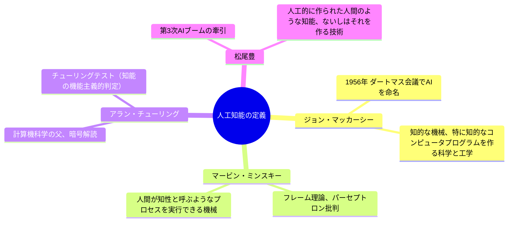
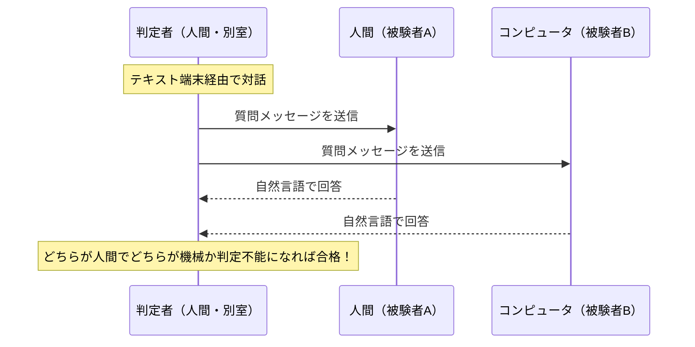
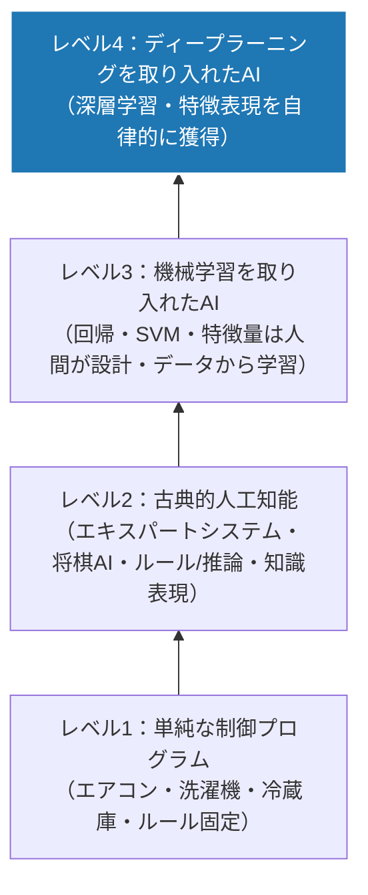
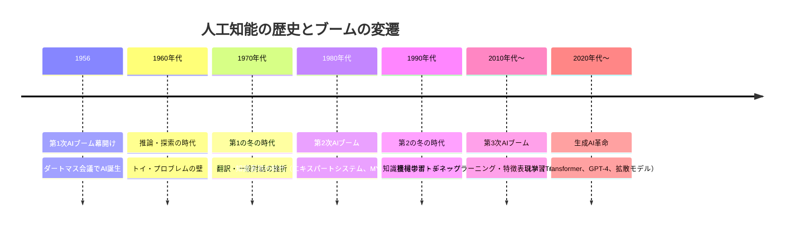
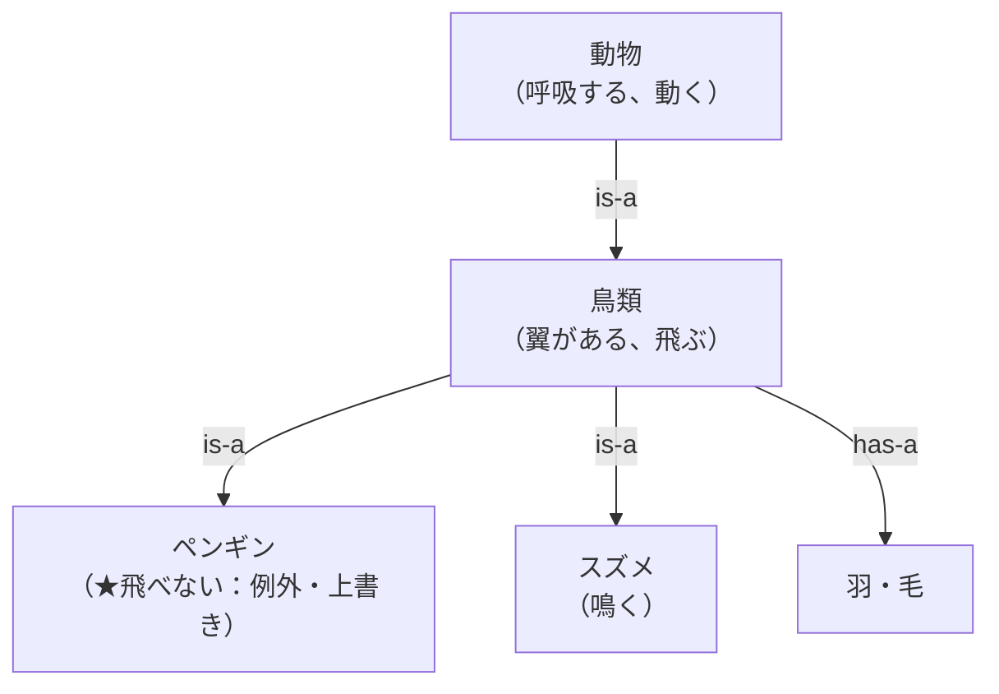
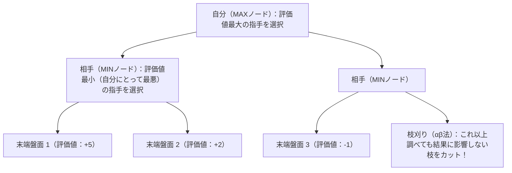

# 第1章：人工知能（AI）の歴史と定義

> [!NOTE]
> **【2026年最新シラバスにおける学習戦略：歴史分野の出題激減】**
> 近年のG検定（G2024#6以降）において、コンピュータの初期史（ENIAC、ロジック・セオリスト、第5世代コンピュータ、深層信念ネットワークDBN等の枝葉の年代・型番）に関する出題比率は**全体の約5%未満に大幅縮小**しています（合格体験記でも「歴史暗記はほぼ出なかった」と一致）。
> 本章の内容は重箱の隅を暗記するのではなく、**「松尾豊氏のAIレベル分類（1〜4）」「探索アルゴリズムの仕組み（幅優先・深さ優先・A*）」「フレーム理論の基本構造（スロット/フィラー/デフォルト値）」**など、後続の機械学習や思考枠組みに直結するエッセンスのみを押さえ、スピーディに通過するのが合格の鉄則です。

## 1-1. 人工知能の定義と著名研究者の見解（Q11）

「人工知能（Artificial Intelligence）」には、国際的・学術的に統一された単一の定義は存在しません。研究分野や立場によって異なるアプローチが提唱されています。

| 研究者 / 機関 | 主な定義・見解 | キーワード |
| :--- | :--- | :--- |
| **ジョン・マッカーシー** (John McCarthy) | 「知的な機械、特に知的なコンピュータプログラムを作る科学と工学」 | 1956年ダートマス会議、LISP言語の開発 |
| **マービン・ミンスキー** (Marvin Minsky) | 「人間が知性と呼ぶようなプロセスを実行できる機械」 | MIT AIラボ創設、パーセプトロンの限界証明 |
| **ハーバート・サイモン** (Herbert Simon) | 「人間が問題解決、学習、創造を行う際の心理学的プロセスを計算機上で模倣すること」 | ノーベル経済学賞、ロジック・セオリスト |
| **松尾豊** | 「人工的に作られた人間のような知能、ないしはそれを作る技術」 | 東京大学教授、JDLA理事長 |

---

## 1-2. チューリングテストと知能の判定（Q12, Q15）

1950年、英国の数学者アラン・チューリング（Alan Turing）は論文『Computing Machinery and Intelligence（計算機と知能）』の中で、知能の本質を問う「イミテーション・ゲーム（模倣ゲーム）」を提案しました。これが**チューリングテスト（Turing Test）**です。

### チューリングテストの本質と留意点
- **機能主義（外見的判定）**: 機械の内部構造や意識の有無ではなく、「外部から見た振る舞いが人間と区別がつかないか」のみを基準とします。
- **ローブナー賞（Loebner Prize）**: チューリングテストに合格する対話プログラムを競うコンテスト（1991年創設）。
- **限界と批判**: ルールや確率に基づいて人間らしく誤魔化す対話スクリプトでも騙せてしまうため、「真の理解」を判定しているわけではないという批判（サールの「中国の部屋」など）を呼びました。

---

## 1-3. 知能の4つのレベル分類（松尾豊氏の体系）（Q13, Q14）

松尾豊氏らは、世の中で「AI」と呼ばれている技術の発展段階と能力を以下の4段階に体系化しました。

| レベル | 名称 | 主な動作原理 | 具体例 | 知識・特徴量の獲得主体 |
| :---: | :--- | :--- | :--- | :--- |
| **レベル1** | **単純な制御プログラム** | センサ入力に対する固定ルール（IF-THEN） | エアコンの温度調整、インバータ洗濯機、全自動炊飯器 | 人間が完全に固定プログラム |
| **レベル2** | **古典的人工知能** | 探索・推論、ルールベース、知識ベース | エキスパートシステム、チェスプログラム、掃除ロボット | 人間が辞書・ルールを手作業入力 |
| **レベル3** | **機械学習を取り入れたAI** | 統計的機械学習（回帰、決定木、SVM等） | スパムメールフィルタ、検索エンジンのレコメンド | **人間が「特徴量」を手動設計**し、重みをデータから学習 |
| **レベル4** | **ディープラーニング** | 多層ニューラルネットワーク | 画像認識、LLM（ChatGPT）、音声認識、自動運転 | **AI自身が「特徴表現（特徴量）」をデータから自律学習** |

---

## 1-4. AIの歴史：3つのブームと2つの冬の時代（Q16..Q30）

人工知能の研究は、過度な期待（ブーム）と技術的限界による失望（冬の時代）を繰り返して進化してきました。

### 第1次AIブーム（1950〜60年代）：推論と探索の時代
- **核心技術**: 迷路探索、パズル、チェス、定理証明（Logic Theorist）。
- **探索アルゴリズムの比較**:
  - **幅優先探索（BFS）**: 同じ深さのノードをすべて調べてから次へ進む。**最短手数の解を必ず発見**できるが、ノード数が指数関数的に増大し**メモリ消費が極大**。
  - **深さ優先探索（DFS）**: 一つの枝を深く掘り進める。メモリ消費は少なくて済むが、**最短手数とは限らず**、無限ループに陥る危険がある。
  - **A*（A-star）アルゴリズム**: 評価関数 $f(n) = g(n) + h(n)$ を使用。$g(n)$ は開始点から現在ノードまでの確定コスト、$h(n)$ はゴールまでの推定コスト（ヒューリスティック関数）。$h(n)$ が実際の最小コスト以下（許容的）であれば**必ず最適解を発見**できる。
- **終息の理由（第1の冬）**: 現実の複雑な問題は解けず、「トイ・プロブレム（おもちゃの問題）」しか解けないことが判明。

### 第2次AIブーム（1980年代）：知識表現の時代
- **核心技術**: コンピュータに専門家の知識をルール（IF-THEN）として蓄積する「エキスパートシステム」。
  - **DENDRAL**: スタンフォード大学が開発。未知の有機化合物の質量分析データから分子構造を決定。
  - **MYCIN**: スタンフォード大学が開発。血液中の細菌感染症の診断および抗生物質の処方支援（不確実性を扱う確信度係数CFを導入）。
- **知識表現の規格**:
  - **セマンティックWeb**: メタデータを主語・述語・目的語の3つ組（トリプル）で記述する **RDF（Resource Description Framework）** や、厳密なオントロジー言語 **OWL（Web Ontology Language）**。
  - **Cycプロジェクト（ダグ・レナート）**: 人間の「常識」を数百万の述語論理ルールとして網羅的に記述しようとした野心的なプロジェクト。
- **終息の理由（第2の冬）**:
  - **知識獲得のボトルネック**: 専門家の暗黙知や例外ルールを人間が手作業で入力・保守することに限界が来た。
  - ルール同士の矛盾や例外処理の破綻。

### 第3次AIブーム（2010年代〜）：機械学習とディープラーニングの時代
- **起爆剤**:
  - ビッグデータの蓄積（インターネット・スマートフォンの普及）。
  - GPU（Graphics Processing Unit）による並列計算パワーの飛躍。
  - **AlexNet（2012年）**: 画像認識コンテストILSVRC 2012で圧倒的大差で優勝。
- **パラダイムシフト**: 人間が特徴量を苦心して手作業で作る時代から、多層ニューラルネットワークが**「特徴表現（Representation）」を自律的に学習する時代**へ。

---

## 1-5. 知識表現の代表モデル（意味ネットワークとフレーム理論）（Q31..Q35）

コンピュータに概念や知識を構造化して保持させるための代表的な枠組みです。

| 知識表現モデル | 提唱者 / 概要 | 構造とキー概念 | G検定での最重要ポイント |
| :--- | :--- | :--- | :--- |
| **意味ネットワーク (Semantic Network)** | アラン・コリンズ & ロス・キリアン (1969) | 概念を「ノード」、関係を「ラベル付き有向エッジ」で表現するグラフ構造 | **is-a 関係（継承関係）**: 下位概念は上位概念の属性を自動的に引き継ぐ（属性継承）。**has-a 関係（部分-全体関係）**。 |
| **フレーム理論 (Frame Theory)** | マービン・ミンスキー (1975) | 人間が特定の状況や対象（例：教室、買い物、車）を認識する際の定型的な知識の枠組み | フレーム内に「**スロット（属性名）**」と「**値（フィラー）**」を保持。明示的な情報がない場合にあらかじめ補完される「**デフォルト値（既定値）**」を持つのが最大の特徴。 |

---

## 1-6. ゲーム探索木（ミニマックス法・αβ法・モンテカルロ木探索）（Q36..Q40）

チェス、将棋、囲碁などの「二人零和有限確定完全情報ゲーム」における探索アルゴリズムの進化です。

| アルゴリズム | 基本メカニズム | 長所 | 課題・適用領域 |
| :--- | :--- | :--- | :--- |
| **ミニマックス法 (Minimax)** | 自分が「評価値最大（Max）」の手を選び、相手が「評価値最小（Min）」の手を選ぶと仮定して木を探索 | 完全読み切り時の最適手順を保証 | 探索深さとともにノード数が爆発的に増大する |
| **αβ法 (Alpha-Beta Pruning)** | 相手がそれより良い手を持っていることが確定した時点で、これ以上調べても評価値が更新されない枝を刈り込む（剪定） | **ミニマックス法と完全に同一の結果を、劇的に少ない計算量で算出** | 評価関数の設計品質に依存 |
| **モンテカルロ木探索 (MCTS)** | ゲーム終了までランダム（または簡易方策）で指し進める**「プレイアウト（シミュレーション）」**を膨大に繰り返し、勝率が高い枝を重点探索（UCB1アルゴリズム） | **評価関数を手作業で設計できない複雑なゲーム（囲碁等）でも強力に動作** | AlphaGoで深層学習（方策ネットワーク＋価値ネットワーク）と統合され人間を圧倒 |

---
