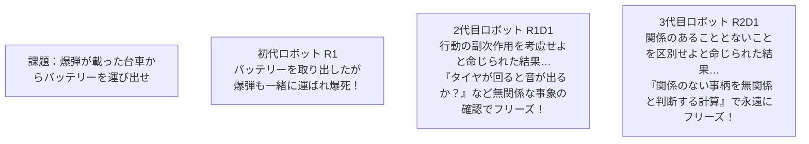
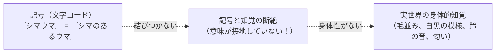
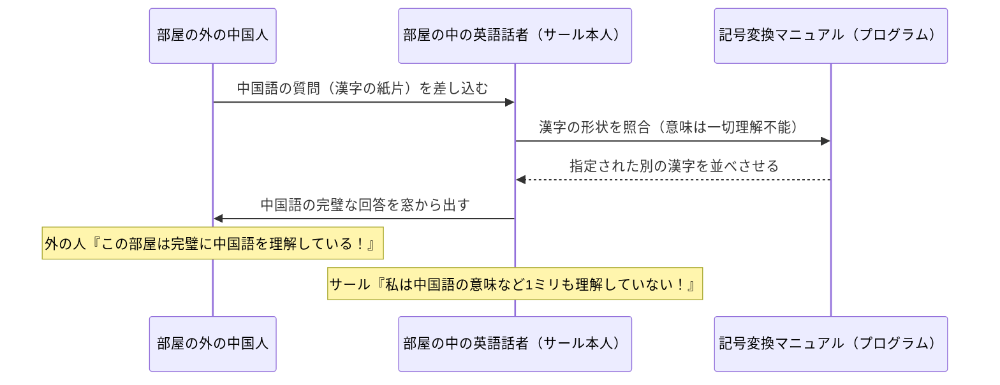

# 第2章：動向と古典的論点（哲学・認知科学・シンギュラリティ）

## 2-1. トイ・プロブレムと実世界問題の壁（Q41）

バートラム・ラファエル（Bertram Raphael）が指摘した**トイ・プロブレム（Toy Problem: おもちゃの問題）**とは、パズルやチェスのように「ルールと前提条件が完全に定義され、不確実性や例外が存在しない単純化された閉じた世界」の問題を指します。

| 比較項目 | トイ・プロブレム（第1次AI） | 実世界問題（Real-world Problem） |
| :--- | :--- | :--- |
| **環境** | 静的・完全情報・有限の離散状態 | 動的・不完全情報・無限の連続状態 |
| **ノイズ** | ノイズなし（100%正確な入力） | センサノイズ、欠損値、曖昧性 |
| **例外・文脈** | 例外なし・前提が固定 | 無数の例外、文脈による解釈の変化 |
| **計算量** | 探索木が有限で計算可能 | 組合せ爆発（Combinatorial Explosion） |

---

## 2-2. フレーム問題（Frame Problem）（Q42, Q43）

1969年にジョン・マッカーシーとパトリック・ヘイズが提起した、AIにおける最も有名な難問です。

> **定義**: 「今からしようとしている行動に関係のある事柄だけを選び出すこと」が、有限の処理能力しか持たないコンピュータには極めて困難であるという問題。

### ダニエル・デネットによる思考実験
哲学者ダニエル・デネット（Daniel Dennett）は、時限爆弾付きの台車からバッテリーを回収するロボットの寓話でフレーム問題の本質を表現しました。
- 人間は進化の過程で、身体性や直感に基づいて「無関係な情報」を無意識に大胆に無視（枝刈り）できますが、論理的推論を行うAIは「無関係であることを確認するための思考」が無数に発生し、**思考停止（フリーズ）**に陥ります。

---

## 2-3. シンボルグラウンディング問題（記号接地問題）（Q44, Q45）

1990年に認知科学者スティーブン・ハルナッド（Stevan Harnad）が提起しました。

> **核心の問い**: 「コンピュータの中で処理されている無味乾燥な記号（シンボル）は、いかにして実世界の現実的な意味や知覚データと結びつくのか？」

### ハルナッドの「シマウマ」の例え
コンピュータの辞書に「シマウマはシマ模様のあるウマである」と教え、さらに「ウマとは…」「シマとは…」と記号をどれだけ連ねても、AIが自らの視覚や触覚を通じて「ウマ」や「シマ」の実態を知覚していなければ、記号は宙に浮いたままであり真の理解には達しません。
近年、画像・音声・言語を統合した**マルチモーダル基盤モデル（Vision-Language Model）**やロボットの身体性（Embodiment）によって、記号接地の突破口が開かれつつあります。

---

## 2-4. 中国語の部屋（Chinese Room）と強いAI・弱いAI（Q46..Q50）

哲学者ジョン・サール（John Searle）が1980年に発表した、チューリングテストに対する痛烈な批判的思考実験です。

### サールの主張の核心
1. **構文論（シンタックス）と意味論（セマンティクス）の分離**:
   - コンピュータは記号の並び替え（構文操作）を行っているだけであり、記号が表す「意味（セマンティクス）」を理解しているわけではない。
2. **強いAI（Strong AI）と弱いAI（Weak AI）の対比**:
   - **強いAI（汎用人工知能 / AGI）**: 人間のような真の心、主観的意識、理解、クオリアを持つ機械。サールは単なる記号処理機械が強いAIになることはないと否定。
   - **弱いAI（特化型人工知能）**: 意識や心は持たないが、特定のタスク（画像分類、音声認識、チェス）において知的な道具として有用に機能する機械。現在の商用AIはすべてこれに属する。

---

## 2-5. 記号創発問題と身体性アプローチ（Q51..Q60）

谷口忠大氏らによって提唱された**記号創発問題（Symbol Emergence Problem）**は、シンボルグラウンディング問題をさらに発展させたものです。

- **静的な付与から動的な創発へ**: 人間がラベル（記号）を上から与えて接地させるのではなく、環境と身体が相互作用する中で、エージェント同士のコミュニケーションや感覚運動経験を通じて**自律的に記号とその意味が立ち現れる（創発する）システム**を解明しようとするアプローチです。
- **ロドニー・ブルックスのサブサンプション・アーキテクチャ（包摂構造）**:
  - ルールや世界モデルを持たず、単純な反射動作（障害物回避）をボトムアップに積み重ねて知的な行動を生み出す自律分散型ロボット制御理論。「世界はそれ自身の最良のモデルである（環境そのものを参照せよ）」と主張し、掃除ロボット「ルンバ」の祖先となりました。

---

## 2-6. シンギュラリティ（技術的特異点）と社会的議論（Q61..Q70）

レイ・カーツワイル（Ray Kurzweil）が著書『The Singularity Is Near』で提唱した未来予測です。

| 概念 | 提唱者 / 内容 | G検定での問われ方 |
| :--- | :--- | :--- |
| **収穫加速の法則** | レイ・カーツワイル | 技術進歩は直線（線形）ではなく、指数関数的（幾何級数的）に加速するという経験則 |
| **2045年問題** | レイ・カーツワイル | 人工知能が地球上の全人類の知性の総和を超える特異点に到達する予測年 |
| **超知能（Superintelligence）** | ニック・ボストロム | あらゆる分野で人間の最高の知性を遥かに凌駕する知能。アライメント問題の重要性を提唱 |
| **親和性・受容性** | 森政弘「不気味の谷現象」 | ロボットが人間に近づくにつれて好感度が増すが、ある一定の不自然さで急激に恐怖・嫌悪感が生じる現象 |

---
