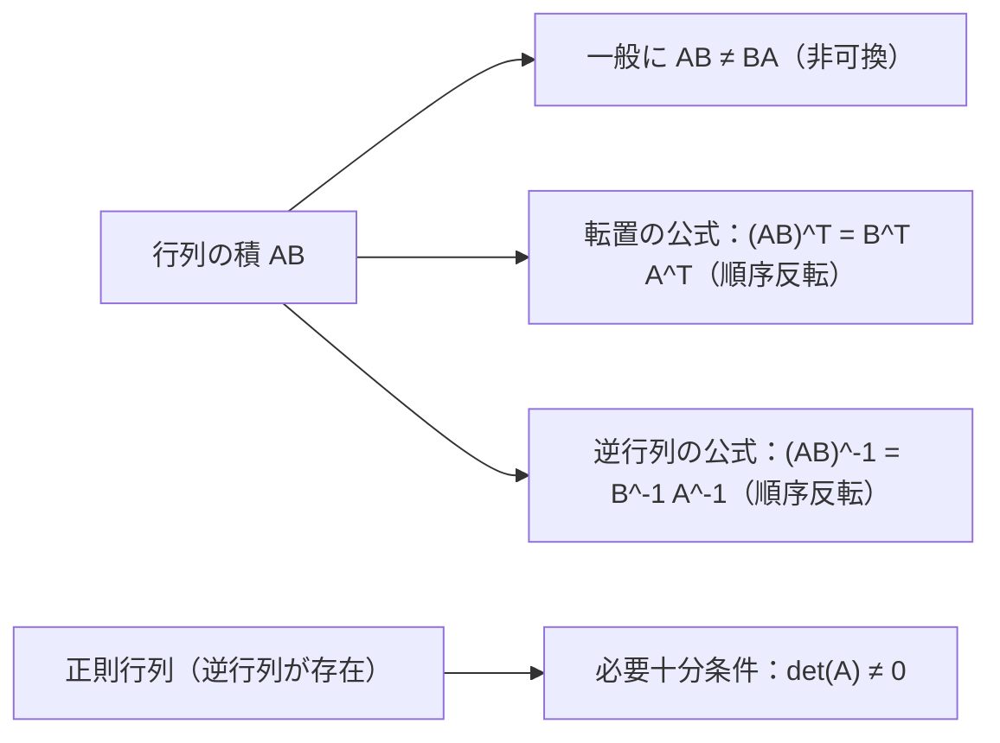
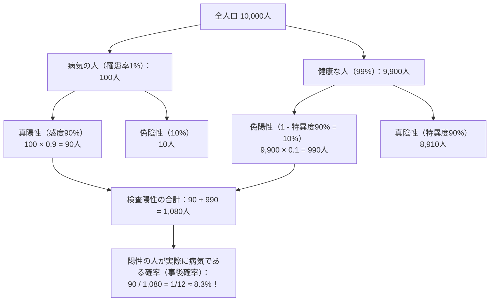

# 第3章：基礎数学・統計・情報理論（超重要・計算問題完全攻略）

## 3-1. 線形代数（ベクトル・行列・固有値）（Q71..Q77）

機械学習・深層学習において、データやパラメータはすべてベクトルと行列として表現されます。G検定では数式の直感的理解と簡単な数値計算が頻出します。

### ベクトルの内積・アダマール積・ノルムの計算

- **内積（ドット積 / Dot Product / Inner Product）**:
  $$\mathbf{a} \cdot \mathbf{b} = \sum_{i=1}^n a_i b_i = \|\mathbf{a}\| \|\mathbf{b}\| \cos \theta$$
  - **計算ルール**: ベクトルの対応する成分同士を掛け合わせ、その**総和（合計）**を計算する。
  - **計算結果の型**: **スカラー（単一の実数値）**
  - **具体例**: $\mathbf{a} = (2, 3), \mathbf{b} = (4, -1)$ の場合
    $$\mathbf{a} \cdot \mathbf{b} = 2 \times 4 + 3 \times (-1) = 8 - 3 = 5$$
  - **深層学習での応用**: 全結合層の線形変換（$\mathbf{w}^T \mathbf{x}$）、コサイン類似度の算出、Attentionスコアの計算（$QK^T$）。

- **アダマール積（要素積 / 要素ごとの積 / Hadamard Product / Element-wise Product）**:
  $$\mathbf{a} \odot \mathbf{b} = (a_1 b_1, a_2 b_2, \dots, a_n b_n)$$
  - **計算ルール**: ベクトルの**同じ位置にある対応要素同士をそれぞれ掛け算**する（足し合わせない）。
  - **計算結果の型**: 元のベクトルと同じ次元を持つ**ベクトル（配列）**
  - **具体例**: $\mathbf{a} = (2, 3), \mathbf{b} = (4, -1)$ の場合
    $$\mathbf{a} \odot \mathbf{b} = (2 \times 4, \ 3 \times (-1)) = (8, -3)$$
  - **深層学習での応用**:
    - **LSTM / GRU のゲート機構**: 忘却ゲート $f_t$ や入力ゲート $i_t$ とセル状態 $C_{t-1}$ の間で、情報を通す割合を要素ごとに制御する演算（$\mathbf{f}_t \odot \mathbf{c}_{t-1}$）。
    - **Dropout のマスク適用**: ランダムに生成した $0$ と $1$ のマスクベクトルを入力ベクトルに要素ごとに掛けてノードを無効化する処理（$\mathbf{h} \odot \mathbf{m}$）。
    - **画像処理**: ピクセルごとの明暗調整やマスク処理。

- **【最重要・試験トラップ対策】内積 vs アダマール積の徹底対比表**:
  | 比較項目 | 内積（ドット積 / Dot Product） | アダマール積（要素積 / Hadamard Product） |
  | :--- | :--- | :--- |
  | **数学記号** | $\mathbf{a} \cdot \mathbf{b}$ または $\mathbf{a}^T \mathbf{b}$ | $\mathbf{a} \odot \mathbf{b}$ または $\mathbf{a} \circ \mathbf{b}$ |
  | **演算ルール** | 掛けて**すべて足し合わせる**（$\sum a_i b_i$） | 掛けて**そのまま並べる**（$(a_1 b_1, \dots)$） |
  | **計算結果** | **スカラー（単一の数値）** | **ベクトル（同じ次元）** |
  | **例：$(2, 3)$ と $(4, -1)$** | $2 \times 4 + 3 \times (-1) = \mathbf{5}$ | $(2 \times 4, 3 \times (-1)) = \mathbf{(8, -3)}$ |
  | **DLでの代表的役割** | コサイン類似度、重み付き線形結合 | LSTMのゲート開閉、Dropoutマスク |

- **L1ノルム（マンハッタンノルム）**:
  $$\|\mathbf{x}\|_1 = \sum_{i=1}^n |x_i|$$
  - 各成分の絶対値の和。碁盤目状の街路を進む最短距離に相当。Lasso正則化で利用。
- **L2ノルム（ユークリッドノルム）**:
  $$\|\mathbf{x}\|_2 = \sqrt{\sum_{i=1}^n x_i^2}$$
  - 直線距離（三平方の定理の拡張）。Ridge正則化やベクトルの正規化で利用。
  - 例：$\mathbf{x} = (3, -4) \implies \|\mathbf{x}\|_1 = |3| + |-4| = 7$, $\|\mathbf{x}\|_2 = \sqrt{3^2 + (-4)^2} = \sqrt{25} = 5$
- **コサイン類似度（Cosine Similarity）**:
  $$\cos \theta = \frac{\mathbf{a} \cdot \mathbf{b}}{\|\mathbf{a}\| \|\mathbf{b}\|}$$
  - ベクトルの「長さ」の影響を排除し、「向きの一致度（$-1$〜$+1$）」を評価。自然言語処理（単語埋め込み）で多用。

### 行列の性質と演算規則

- **固有値と固有ベクトル**:
  $$A \mathbf{x} = \lambda \mathbf{x} \quad (\mathbf{x} \neq \mathbf{0})$$
  - 行列 $A$ を掛けても「向き」が変わらず、長さが $\lambda$ 倍に伸縮するだけのベクトル $\mathbf{x}$ を**固有ベクトル（Eigenvector）**、その倍率 $\lambda$ を**固有値（Eigenvalue）**と呼ぶ。主成分分析（PCA）の数学的基盤。
  - 正方行列の固有値の総和は、その行列の対角成分の和（トレース）に等しい。

---

## 3-2. 微分と最適化（勾配降下法）（Q78..Q82）

### 合成関数の微分（連鎖律: Chain Rule）
多層ニューラルネットワークにおいて誤差を出力層から入力層へ遡らせる「誤差逆伝播法（バックプロパゲーション）」の理論的核心です。
$$\frac{dy}{dx} = \frac{dy}{du} \cdot \frac{du}{dx}$$

### 偏微分と勾配ベクトル（Gradient）
多変数関数 $f(x, y)$ において、他の変数を定数とみなして特定の変数のみで微分すること。
- 例：$f(x, y) = x^2 + 3xy + 2y^2$ の点 $(1, 2)$ における $\frac{\partial f}{\partial x}$:
  $$\frac{\partial f}{\partial x} = 2x + 3y \implies 2(1) + 3(2) = 2 + 6 = 8$$

### 勾配降下法の更新式
損失関数 $L(\mathbf{w})$ を最小化するため、勾配 $\nabla L(\mathbf{w})$ と**逆の方向（マイナス方向）**へパラメータを更新する。
$$\mathbf{w} \leftarrow \mathbf{w} - \eta \nabla L(\mathbf{w})$$
- $\eta$（イータ）：学習率（Learning Rate）。
  - 大きすぎる場合：最適解を飛び越えて発散（振動）する。
  - 小さすぎる場合：収束に膨大な時間がかかり、局所最適解（ローカルミニマム）や鞍点（Saddle Point）で停止する。

---

## 3-3. 確率・統計・ベイズの定理（Q83..Q93）

### 確率と期待値の速解テクニック
- **期待値（Expected Value: $E[X]$）**:
  $$E[X] = \sum_{i=1}^n x_i P(X = x_i)$$
  - 「取りうる値 $x_i$」に「その値をとる確率 $P(x_i)$」を掛けてすべて足し合わせた加重平均。
  - **サイコロの出目の期待値**:
    $$E[X] = 1\left(\frac{1}{6}\right) + 2\left(\frac{1}{6}\right) + 3\left(\frac{1}{6}\right) + 4\left(\frac{1}{6}\right) + 5\left(\frac{1}{6}\right) + 6\left(\frac{1}{6}\right) = \frac{21}{6} = 3.5$$
（Q83..Q93）

### ベイズの定理（Bayes' Theorem）と事後確率計算
$$P(A|B) = \frac{P(B|A) P(A)}{P(B)}$$
- $P(A)$：事前確率（Prior Probability）
- $P(A|B)$：事後確率（Posterior Probability）
- $P(B|A)$：尤度（Likelihood）

> **G検定頻出トラップ（検査薬のパラドックス）**:
> 「検査精度90%」であっても、母集団の罹患率が1%と極めて低い場合、陽性者全体の中で「健康なのに誤って陽性となった人（偽陽性：990人）」が圧倒的多数を占めるため、実際に病気である確率は**わずか約8.3%**にしかなりません。直感（90%）と大きく異なるため最頻出の計算問題です。

### 統計的基礎指標と確率分布
| 指標 / 分布 | 定義・特徴 | G検定での最重要ポイント |
| :--- | :--- | :--- |
| **期待値・平均値** | データの重心 $E[X] = \sum x_i p_i$ | 外れ値（極端な大きな値）に強く引っ張られる |
| **中央値（メディアン）** | データを昇順に並べた中央の値 | 外れ値に対して頑健（ロバスト）。偶数個の場合は中央2つの平均 |
| **不偏分散** | $s^2 = \frac{1}{N-1} \sum (x_i - \bar{x})^2$ | 標本から母分散を過小評価なく推定するため **$N-1$（自由度）で割る** |
| **正規分布（ガウス分布）** | 平均 $\mu$、分散 $\sigma^2$ の釣鐘型左右対称分布 | 平均値＝中央値＝最頻値が一致。$\mu \pm 1\sigma$ に約68.3%、$\mu \pm 2\sigma$ に約95.4% |
| **標準正規分布** | 平均 $\mu = 0$、分散 $\sigma^2 = 1$ | 任意の正規分布は $z = \frac{x - \mu}{\sigma}$ により標準化可能 |
| **ポアソン分布** | 単位時間・空間あたりに稀に起きる事象の生起確率 | 交通事故件数、Webサイトへのアクセス頻度など。期待値と分散が等しい（$\lambda$） |
| **中心極限定理** | 独立同分布に従う標本の平均は、母集団の分布が何であれ標本数 $N$ が十分大きければ正規分布に近似する | 統計的推測の基礎 |

---

## 3-4. 情報理論（エントロピーと情報量）（Q94..Q100）

### 自己情報量（Self-Information）
事象 $x$ が起きたときの「驚き」の度合い。滅多に起きない出来事ほど情報量は大きくなる。
$$I(x) = -\log_2 P(x) = \log_2 \frac{1}{P(x)} \quad [\text{bit}]$$
- 確率 $P(x) = 1/8$ のとき：$I(x) = -\log_2(1/8) = \log_2(8) = 3$ ビット。
- 確率 $P(x) = 1$（必ず起きる事象）のとき：$I(x) = -\log_2(1) = 0$ ビット（新しい情報はゼロ）。

### シャノンエントロピー（平均情報量）
情報源の持つ不確実性の度合い。
$$H(X) = -\sum_{i=1}^n P(x_i) \log_2 P(x_i)$$
- **すべての事象が等確率（一様分布）のとき、エントロピーは最大値**をとる（最も予測不能）。
- 事象が1つに偏るほどエントロピーは小さくなり、確定事象（$P=1$）で最小値 $0$ となる。

### 交差エントロピーとKLダイバージェンス
- **交差エントロピー（Cross-Entropy）**: 真の分布 $P$ とモデルの予測分布 $Q$ の乖離度合い。分類問題の標準的な損失関数。
  $$H(P, Q) = -\sum P(x) \log Q(x)$$
- **KLダイバージェンス（Kullback-Leibler Divergence）**: 2つの確率分布 $P$ と $Q$ がどれだけ異なるかを測る非対称な尺度（$D_{KL}(P \| Q) \neq D_{KL}(Q \| P)$）。常に非負（$\ge 0$）であり、完全一致で $0$。

---

## 3-5. 発展的数理・統計的推定・検定と線形代数の応用（Q101..Q115）

試験本番で合否を分ける重要応用数理・統計的推測の体系です。

### 統計的推定とMAP推定（Q101..Q103）
- **最尤推定（MLE: Maximum Likelihood Estimation）**: 与えられた観測データが得られる尤度 $L(	heta)$ を最大化するパラメータを推定。
- **最大事後確率推定（MAP推定: Maximum A Posteriori）**: ベイズの定理に基づき、事前分布 $P(	heta)$ を考慮して事後確率 $P(	heta|D) \propto P(D|	heta)P(	heta)$ を最大化する。
  - 事前分布に平均0の正規分布を仮定すると **L2正則化（Ridge）**、ラプラス分布を仮定すると **L1正則化（Lasso）** に数学的に一致する。

### 活性化関数と数値特性（tanhと原点対称性）（Q104..Q105）
- **双曲線正接関数（tanh）**: 出力域は $(-1, 1)$。
  $$\tanh(x) = \frac{e^x - e^{-x}}{e^x + e^{-x}}$$
  標準シグモイド関数 $(0, 1)$ と異なり**原点対称（Zero-centered）**であるため、勾配の符号が偏らずバックプロパゲーションが効率的に進行する。

### 線形代数の発展（一次独立・ランク・特異値分解）（Q106..Q109）
- **一次独立（Linearly Independent）**: ベクトル群のどの1つも他の線形結合で表せない関係。
- **行列の階数（Rank / ランク）**: 行列の一次独立な行ベクトル（または列ベクトル）の最大本数。
- **特異値分解（SVD: Singular Value Decomposition）**: 任意の $m \times n$ 行列 $A$ を直交行列 $U, V$ と対角行列 $\Sigma$ に分解する手法（$A = U \Sigma V^T$）。画像圧縮、協調フィルタリング（レコメンド）、潜在意味解析（LSA）の基盤。

### 統計的仮説検定・過誤・チェビシェフの不等式（Q110..Q115）
- **第1種の過誤（Type I Error, $\alpha$）**: 「帰無仮説 $H_0$ が真であるにもかかわらず誤って棄却してしまう誤り」（偽陽性 / あわてものの誤り）。有意水準 $\alpha$ に設定。
- **第2種の過誤（Type II Error, $\beta$）**: 「帰無仮説 $H_0$ が偽であるにもかかわらず棄却できない誤り」（偽陰性 / ぼんやりものの誤り）。検出力は $1 - \beta$。
- **p値（p-value）**: 帰無仮説が正しいと仮定したもとで、観測されたデータ以上に極端な結果が得られる確率。$p < \alpha$ のとき帰無仮説を棄却。
- **チェビシェフの不等式（Chebyshev's Inequality）**: 任意の確率分布において、平均 $\mu$ から $k$ 倍の標準偏差 $\sigma$ 以上離れる確率は高々 $1/k^2$ 以下である（$P(|X - \mu| \ge k\sigma) \le \frac{1}{k^2}$）。
