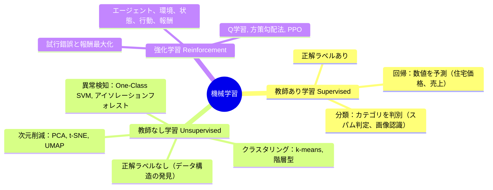
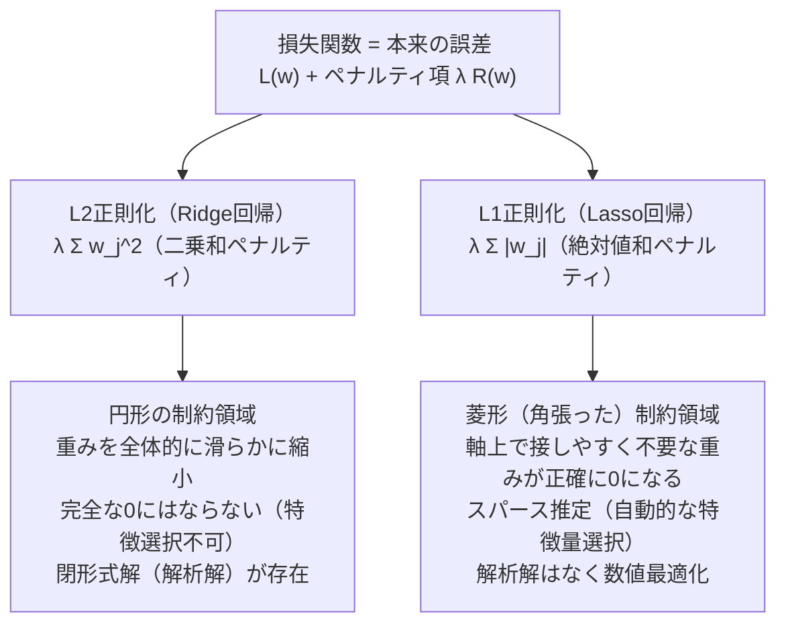
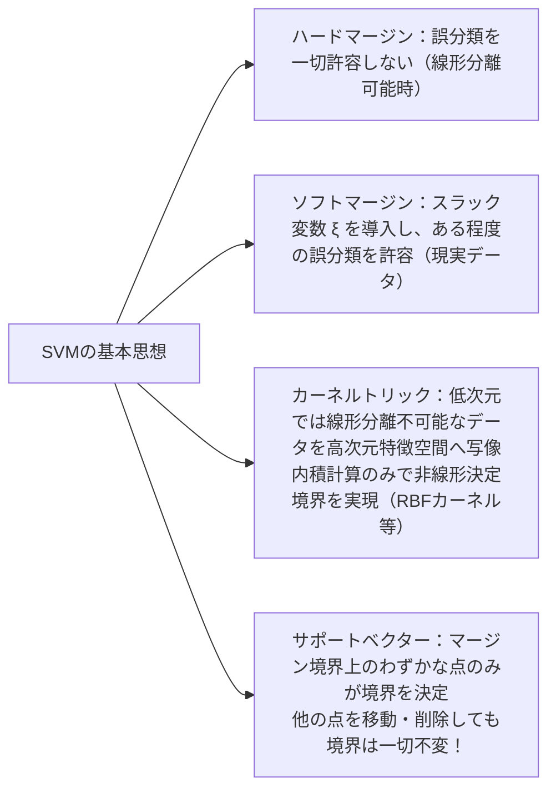
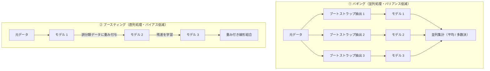
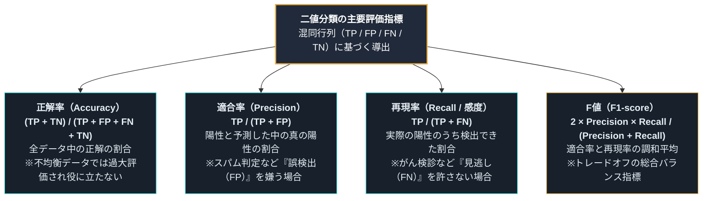
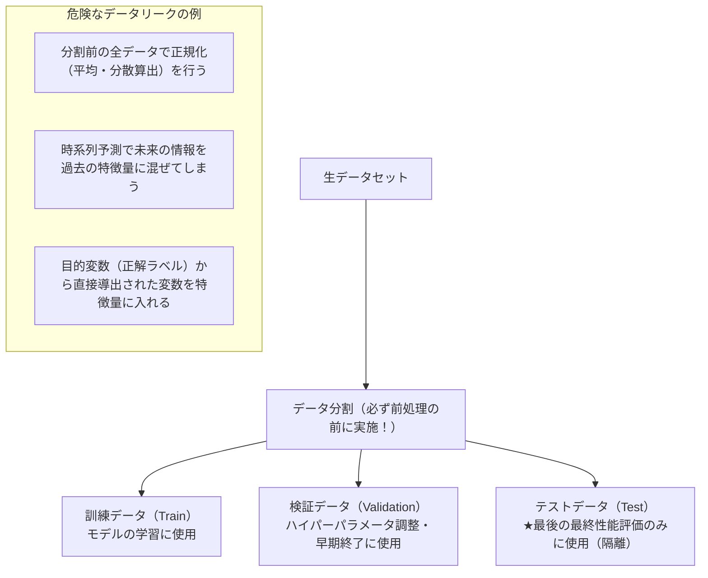
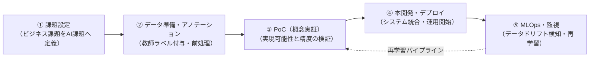

# 第4章：機械学習の基礎アルゴリズムと実践評価

## 4-1. 機械学習の3大パラダイム（Q116..Q117）

---

## 4-2. 線形回帰と正則化（L1 vs L2）（Q118..Q124）

### 多重共線性（マルチコ / Multicollinearity）
説明変数（特徴量）同士の間に強い相関関係が存在する場合に生じる問題。
- **弊害**: 行列演算が特異に近くなり、回帰係数の分散が極端に増大し、係数の符号が直感と逆転するなどモデルの解釈性が崩壊する。
- **診断と対策**: **VIF（Variance Inflation Factor: 分散拡大係数）**が通常10を超えると深刻。相関の高い変数を削除するか、主成分分析（PCA）で合成するか、**L2正則化（Ridge）**を適用して解決する。

### 正則化（Regularization）：過学習を防ぐ防壁
モデルの複雑さ（重みの大きさ）にペナルティを科すことで汎化性能を高める技術。

| 比較項目 | L2正則化（Ridge / リッジ） | L1正則化（Lasso / ラッソ） |
| :--- | :--- | :--- |
| **ペナルティ項** | $\lambda \sum w_j^2$（重みの二乗和・L2ノルム） | $\lambda \sum \|w_j\|$（重みの絶対値和・L1ノルム） |
| **制約領域の形状** | 円形（球体） | 菱形（多胞体・角が軸上にある） |
| **パラメータの挙動** | 0に近い小さな値に全体的に縮小（Shrink） | 不要な重みを**正確に「ゼロ」**にする |
| **特徴量選択効果** | なし（すべての変数が残る） | **あり（スパース化・自動選択）** |
| **多重共線性の抑制** | **極めて有効**（係数の暴走を抑え安定化） | 相関のある変数からランダムに1つ選んで他を0にする |
| **Elastic Net** | L1正則化とL2正則化を線形結合でハイブリッドした手法（両者の長所を併せ持つ） |

---

## 4-3. 分類アルゴリズム（ロジスティック回帰・SVM）（Q125..Q135）

### ロジスティック回帰（Logistic Regression）
- **名前は回帰だが「分類」アルゴリズム**。
- オッズ比の対数（対数オッズ / ロジット）を線形モデルで表し、**シグモイド関数**に通すことで出力を $(0, 1)$ の確率値として予測する。

### サポートベクターマシン（SVM: Support Vector Machine）
2クラス分類において、マージン（境界線と最も近いデータ点との距離）を最大化する分離超平面を求める手法。

---

## 4-4. 決定木とアンサンブル学習（Q136..Q145）

### 決定木（Decision Tree）とジニ不純度
- データを条件分岐によって順次分割していく木構造モデル。解釈性が極めて高く、特徴量のスケーリング（標準化）が不要。
- 分割基準：**ジニ不純度（Gini Impurity）**または**エントロピー（情報利得）**。
  $$I_G = 1 - \sum_{k=1}^K p_k^2$$
  - 例：2クラスの割合が 60% : 40%（$0.6, 0.4$）のとき：
    $$I_G = 1 - (0.6^2 + 0.4^2) = 1 - (0.36 + 0.16) = 1 - 0.52 = 0.48$$
- **過学習とプルーニング（剪定）**: 木を深く伸ばしすぎると訓練データに過剰適合するため、事前に最大深さを制限する「事前剪定」や、構築後に不要な枝を刈る「事後剪定」を行う。

### アンサンブル学習の3大アプローチ
複数の弱学習器（Weak Learner）を束ねて単一の強力なモデルを構築する手法。

| 比較項目 | バギング（Bagging） | ブースティング（Boosting） | スタッキング（Stacking） |
| :--- | :--- | :--- | :--- |
| **学習方式** | **完全並列（独立に学習）** | **直列逐次（前の誤差を補正）** | 2段階（予測値をメタ特徴量化） |
| **サンプリング** | **ブートストラップ（重複を許すランダム抽出）** | 全データ（誤りサンプルの重みを変更） | 交差検証でメタ特徴量を生成 |
| **主たる効果** | **バリアンス（分散）の低減（過学習防止）** | **バイアス（偏り）の低減（表現力向上）** | 異なるアルゴリズムの相乗効果 |
| **代表的アルゴリズム** | **ランダムフォレスト**（決定木＋特徴選択） | **AdaBoost, GBDT（XGBoost, LightGBM, CatBoost）** | メタモデル（ロジスティック回帰等） |
| **弱点** | 計算資源を消費 | 外れ値に過剰適合しやすい、直列のため並列化に制約 | 構成が複雑で解釈困難 |

---

## 4-5. 教師なし学習（クラスタリング・次元削減）（Q146..Q155）

### クラスタリング手法の比較
- **k-means法（非階層型）**:
  - あらかじめクラスタ数 $k$ を指定。各点を最も近い重心（セントロイド）に割り当て、重心を再計算する反復アルゴリズム。
  - 初期値依存性があり局所解に陥りやすい $\implies$ **k-means++**（初期セントロイドを確率的に互いに離して選ぶ）で改善。
  - 球状のクラスタを仮定するため、同心円や三日月のような非線形形状の分離は苦手。
- **階層型クラスタリング**:
  - デンドログラム（樹形図）を形成。凝集型（ボトムアップ）と分裂型。
  - クラスタ間距離の計算法：単連結法（最短距離）、完全連結法（最長距離）、**ウォード法（Ward法: 合併による平方和の増加量を最小化、最も広く利用）**。
- **DBSCAN（密度ベース）**:
  - データの密度に基づいてクラスタを形成。クラスタ数を事前指定する必要がなく、ノイズ（外れ値）の検出が可能で非線形形状にも対応。

### 主成分分析（PCA: Principal Component Analysis）
高次元データを、データの分散が最大となる直交軸（主成分）へと線形射影する教師なし次元削減手法。
- **固有値分解**: データ共分散行列の固有値問題 $C \mathbf{v} = \lambda \mathbf{v}$ を解く。
- **寄与率と累積寄与率**:
  $$\text{第 } k \text{ 主成分の寄与率} = \frac{\lambda_k}{\sum_{i=1}^p \lambda_i}$$
  - 固有値の大きさは、その主成分軸が捉えているデータの分散の大きさに比例する。

---

## 4-6. モデル評価とバリデーション（Q156..Q175）

### 混同行列（Confusion Matrix）と評価指標の計算式
二値分類における「真のクラス」と「予測クラス」の組み合わせ。

| | 予測：陽性（Positive） | 予測：陰性（Negative） |
| :---: | :---: | :---: |
| **実際：陽性（Positive）** | **TP（真陽性: True Positive）** | **FN（偽陰性: False Negative）** |
| **実際：陰性（Negative）** | **FP（偽陽性: False Positive）** | **TN（真陰性: True Negative）** |

### ROC曲線とPR曲線の使い分け（最頻出）
- **ROC曲線（Receiver Operating Characteristic）**:
  - 縦軸に**真陽性率（TPR＝再現率）**、横軸に**偽陽性率（FPR＝$FP / (FP + TN) = 1 - \text{特異度}$）**をプロット。
  - AUC（Area Under Curve）が $1.0$ に近いほど高性能（ランダム推測は $0.5$）。
- **不均衡データにおけるPR曲線**:
  - 陽性データが 0.1% しかないような極端な不均衡データでは、すべて陰性と判定する無能なモデルでも正解率 99.9%、ROC-AUCも高くなってしまう。
  - このような場合は、陰性の数（$TN$）に惑わされない**「PR曲線（Precision-Recall曲線）」**を用いて評価する。

### バイアス・バリアンスのトレードオフ
$$\text{総期待誤差} = \text{バイアス}^2 + \text{バリアンス} + \text{不可避のノイズ}$$
- **バイアス（偏り）**: モデルの表現力不足による系統的誤差（Underfitting / 未学習）
- **バリアンス（分散）**: 訓練データの個体差やノイズへの過敏反応による誤差（Overfitting / 過学習）
- **不可避のノイズ**: データ収集時に本質的に含まれるランダム誤差
- 最適なモデル複雑さは、バイアスとバリアンスの和が最小となる中間点に存在する。

---

## 4-7. データ分割とデータリーク（Data Leakage）（Q176..Q182）

機械学習の実務と試験において、最も注意すべき落とし穴が**データリーク（情報漏洩）**です。

- **データリークの本質**: 本来テスト（推論）時には知り得ないはずの情報が、誤って訓練データに漏れ込んでしまうこと。学習時の見かけ上のスコアは極めて高くなるが、未知データ（本番環境）での予測精度が破滅的に低下する。
- **正しい前処理の鉄則**: 標準化（スケーリング）や欠損値補完を行う際は、**「訓練データのみ」を用いて統計量（平均・分散・中央値）を算出し（`fit`）**、その算出した値を検証・テストデータへ適用（`transform`）しなければならない。

---

## 4-8. AIプロジェクト推進・PoC・MLOps・データドリフト（Q183..Q190）

| 概念 | 定義・内容 | 実務・試験での重要論点 |
| :--- | :--- | :--- |
| **PoC (Proof of Concept)** | 概念実証。本格開発に入る前に、小規模なデータと簡易モデルで「そもそもAIで解決可能か」「実用に足る精度が出るか」を検証する試行フェーズ | **PoC死（PoC倒れ）の回避**: 目的や成功基準（KPI）が曖昧なままPoCを繰り返し、本番運用に至らずプロジェクトが頓挫する現象を防ぐため、事前に合格ラインを明確に設定する |
| **アノテーション (Annotation)** | 生データ（画像、音声、テキスト）に対して、正解ラベルやタグを付与する作業 | 膨大な人手とコストがかかるため、クラウドソーシングや**アクティブラーニング（能動学習: モデルの確信度が低いデータのみを人間に優先アノテーションさせる手法）**が活用される |
| **MLOps (Machine Learning Operations)** | 機械学習モデルの開発（Dev）と運用（Ops）を密連携させ、CI/CD/CT（継続的インテグレーション・デプロイ・学習）を自動化する運用基盤 | モデルの性能監視、バージョン管理（コード、データ、モデル重み）、自動再学習パイプラインの構築 |
| **データドリフト (Data Drift)** | 時間の経過とともに、**入力データの確率分布 $P(X)$ が変化**してしまう現象（例：ユーザー層の変化、季節変動、センサの経年劣化） | モデルを放置すると予測精度が劣化するため、定期的なドリフト検知と新規データによる再学習が必須 |
| **コンセプトドリフト (Concept Drift)** | 入力データ $X$ と正解ラベル $Y$ の**関係性 $P(Y\|X)$ 自体が変化**する現象（例：パンデミックによる消費行動や不正パターンの変化） | ドリフトの型（突発的、漸進的、周期的）を監視して対応 |

---
