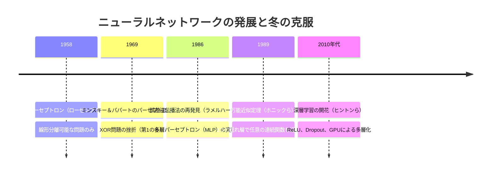
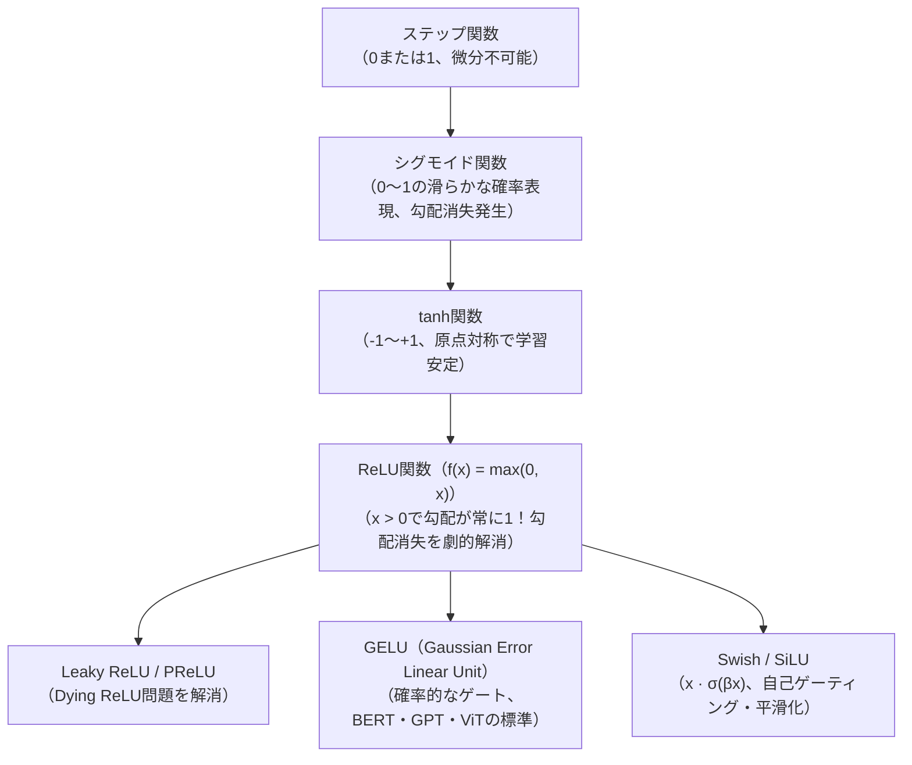
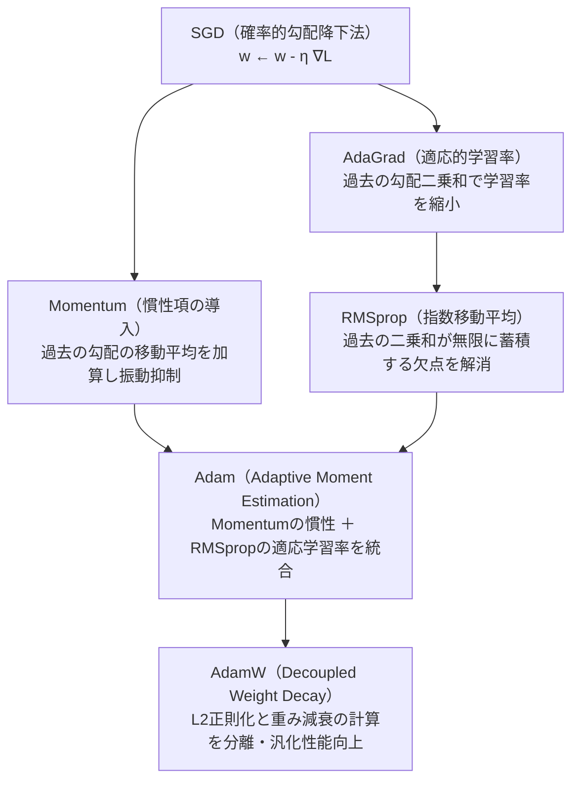
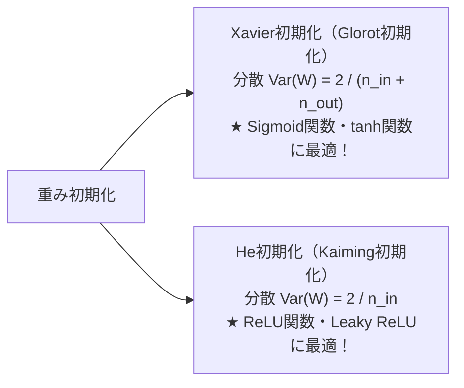
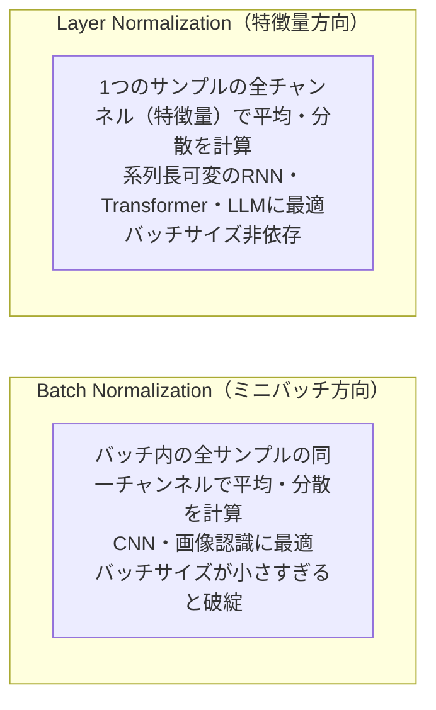

# 第5章：ディープラーニングの基本原理と要素技術

## 5-1. ニューラルネットワークの基礎と限界の克服（Q191..Q195）

### XOR問題と非線形性の本質
- **単純パーセプトロン**: 1本の直線（超平面）で空間を2分する「線形分離可能（Linearly Separable）」な問題しか解けない。
- **XOR（排他的論理和）問題**: 入力 $(0, 1)$ と $(1, 0)$ が陽性、$(0, 0)$ と $(1, 1)$ が陰性となる問題。単一の直線では絶対に分離不可能。
- **多層化と非線形活性化関数**: 隠れ層（中間層）を追加し、各ユニットに「非線形活性化関数」を噛ませることで、空間を歪めて非線形な決定境界を形成できるようになる。
- **万能近似定理（Universal Approximation Theorem）**: 適切な非線形活性化関数を備えた多層パーセプトロンは、隠れ層のユニット数が十分に多ければ、いかなる任意の連続関数でも任意の精度で近似できることが数学的に証明されている。

---

## 5-2. 活性化関数の進化系譜（Q196..Q200）

| 活性化関数 | 数式定義 | 出力範囲 | 特徴・長所 | 弱点・注意点 |
| :--- | :--- | :---: | :--- | :--- |
| **シグモイド** | $\sigma(x) = \frac{1}{1 + e^{-x}}$ | $(0, 1)$ | 2値分類の出力層で確率表現に利用 | 入力の絶対値が大きいと勾配がほぼ0（**最大でも0.25**）になり、多層化で**勾配消失**を引き起こす |
| **tanh（双曲線正接）** | $\tanh(x) = \frac{e^x - e^{-x}}{e^x + e^{-x}}$ | $(-1, 1)$ | 出力平均が0（Zero-centered）になりシグモイドより勾配降下が安定 | シグモイドと同様に両端で勾配飽和（消失）する |
| **ReLU（Rectified Linear Unit）** | $f(x) = \max(0, x)$ | $[0, \infty)$ | **計算が極めて高速、正の領域で勾配が常に1**となり深層化を可能にした | $x < 0$ で勾配が0になり、一度負に沈むとニューロンが二度と発火しなくなる（**Dying ReLU現象**） |
| **Leaky ReLU** | $f(x) = \max(\alpha x, x) \; (\alpha \approx 0.01)$ | $(-\infty, \infty)$ | 負の領域にも微小な傾きを持たせ、ニューロン死滅を防止 | ハイパーパラメータ $\alpha$ の調整が必要 |
| **GELU** | $x \cdot \Phi(x) \; (\Phi$ は標準正規分布の累積分布$)$ | $(-0.17, \infty)$ | 入力の大きさに応じて確率的にドロップアウトする挙動。連続的で微分可能 | **現代の基盤モデル（BERT, GPT, ViT）のデファクトスタンダード** |

### 温度付きソフトマックス関数（Softmax with Temperature）
多クラス分類の出力層で確率分布に変換する関数。
$$\text{Softmax}(z_i) = \frac{e^{z_i / T}}{\sum_{j} e^{z_j / T}}$$
- **温度 $T = 1$**: 通常のソフトマックス。
- **高温（$T > 1$）**: 確率分布が平坦（均等）になり、LLMにおいて生成テキストの**多様性・創造性（ランダム性）が向上**する。
- **低温（$T \to 0$）**: 最もスコアの高い選択肢の確率が1に近づき、**決定的・安定的・論理的な回答**を出力する。

---

## 5-3. 最適化アルゴリズム（Optimizer）の進化（Q201..Q207）

勾配降下法において、パラメータをどのように効率的に更新して損失関数の大域的最適解へと導くかのアルゴリズムです。

| オプティマイザ | 核心アイデア・更新特性 | 長所 | 短所・注意点 |
| :--- | :--- | :--- | :--- |
| **SGD** | ミニバッチごとに勾配を計算して更新 | シンプルでメモリ消費小 | 鞍点（Saddle Point）や狭い谷で振動し停滞 |
| **Momentum** | 物理的な球が坂を転がり落ちる「慣性（運動量）」を付加 | 振動を打ち消し、局所解や鞍点を勢いで脱出 | 慣性がつきすぎて谷底を行き過ぎることがある |
| **AdaGrad** | 頻出するパラメータの学習率を小さく、稀なパラメータの学習率を大きく自動調整 | パラメータごとの自動チューニング | **二乗和を蓄積し続けるため、学習が進むと学習率が0に近づき更新が完全に止まる** |
| **RMSprop** | 過去の勾配二乗和を「指数移動平均（EMA）」で重み付け減衰 | AdaGradの学習率急減問題を克服 | 追加のハイパーパラメータ（減衰率）が必要 |
| **Adam** | 1次モーメント（平均＝Momentum）と2次モーメント（分散＝RMSprop）を同時に保持し偏り補正 | **深層学習で最も汎用的に使われる第一選択肢** | 理論上の収束保証に一部例外がある |
| **AdamW** | AdamにおいてL2正則化項が適応的学習率でスケーリングされてしまう問題を是正し、重み減衰（Weight Decay）を純粋に適用 | **TransformerやLLMの事前学習における標準** | Adamより設定パラメータの挙動が厳密 |

---

## 5-4. 重み初期化と正規化技術（Q208..Q220）

### 重みパラメータ初期化の重要性
重みをすべて「ゼロ」や同一の値で初期化すると、すべてのニューロンが全く同じ勾配を受け取り、対称性が崩れず何層重ねても1つのニューロンと同じになってしまいます（対称性の破綻）。

> **G検定鉄板の組み合わせ**:
> - **Sigmoid / tanh $\iff$ Xavier（グロロ）初期化**
> - **ReLU $\iff$ He（カイミング）初期化**

### 正規化（Normalization）手法の決定版比較
内部共変量シフト（Internal Covariate Shift）を抑え、学習を劇的に安定化させる技術。

| 手法 | 平均・分散の計算方向 | 主な適用領域 | バッチサイズ依存性 | 推論時の挙動 |
| :--- | :--- | :--- | :---: | :--- |
| **Batch Normalization (BN)** | ミニバッチ方向（全サンプルの同一チャネル） | **CNN（画像処理）** | **強烈に依存**（$N < 8$ で不安定化） | 学習時に蓄積した**移動平均・移動分散を固定使用** |
| **Layer Normalization (LN)** | 特徴量方向（各サンプル内の全隠れユニット） | **Transformer, LLM, RNN** | **完全に非依存**（バッチサイズ1でも同一） | 推論時も入力サンプル単体の統計量でそのまま計算 |
| **Group Normalization (GN)** | チャネルを複数のグループに分割して正規化 | 物体検出・高解像度画像 | 非依存（小バッチでもBN同等の性能） | 推論時も入力サンプル単体で計算 |

---

## 5-5. 発展的学習パラダイム・自己教師あり学習・知識蒸留（Q221..Q245）

ディープラーニングの実務と最新試験において重要性を増している発展的要素技術です。

### 勾配消失・爆発の総合対策（Q221..Q225）
深層化に伴う勾配消失（Vanishing Gradient）および勾配爆発（Exploding Gradient）に対する代表的アプローチ：
1. **活性化関数の見直し**: シグモイド関数から **ReLU / LeakyReLU / GELU** への移行。
2. **重み初期化**: **He初期化**（ReLU向け）、**Xavier初期化**（シグモイド/tanh向け）。
3. **スキップ接続（残差接続 / Residual Connection）**: 勾配が直接下層へ流れるバイパス経路の導入（ResNet）。
4. **正規化層**: Batch Normalization, Layer Normalization による内部共変量シフトの抑制。
5. **勾配クリッピング（Gradient Clipping）**: 勾配ノルムが閾値を超えた場合に正規化して縮小（RNN等での爆発防止）。

### 自己教師あり学習（Self-Supervised Learning）と対照学習（Q226..Q235）
大量のラベルなしデータから特徴表現を事前学習する技術：
- **対照学習（Contrastive Learning）**: 同一画像の異なるデータ拡張ペア（正例）を特徴空間で近づけ、異なる画像ペア（負例）を遠ざける。
  - **SimCLR**: 大規模バッチサイズと強力なデータ拡張、プロジェクションヘッドを用いたシンプルな対照学習。
  - **MoCo (Momentum Contrast)**: 動的なキューとモメンタムエンコーダにより、小バッチでも大量の負例を保持。
  - **BYOL / SimSiam**: 負例を使わずに、片方の枝にストップグラディエントを適用することで表現の崩壊（Collapse）を防ぐ手法。

### 知識蒸留（Knowledge Distillation）とモデル軽量化（Q236..Q240）
- **仕組み**: 巨大で高精度な「教師モデル（Teacher）」の出力を、小型で高速な「生徒モデル（Student）」に模倣させて学習させる技術。
- **温度付きソフトマックス**: 温度パラメータ $T > 1$ を適用してロジットを平滑化し、正解クラス以外の「どの不正解クラスにどれだけ似ているか（暗黙知 / Dark Knowledge）」を生徒に学習させる。

### アンサンブル学習とドロップアウトの等価性・損失ランドスケープ（Q241..Q245）
- **Monte Carlo Dropout (MC Dropout)**: 推論時にもドロップアウトを無効化せず複数回順伝播を行い、予測の平均と分散を計算することで、モデルの予測不確実性（Uncertainty）を推定する手法。
- **損失ランドスケープ（Loss Landscape）**: パラメータ空間における損失関数の起伏。幅広く平坦な極小値（Flat Minima）は過学習しにくく汎化性能が高いとされ、バッチサイズや正則化、学習率スケジューリングが形状に寄与する。
