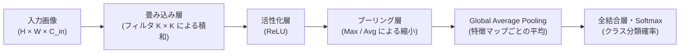
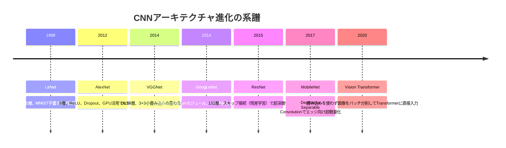
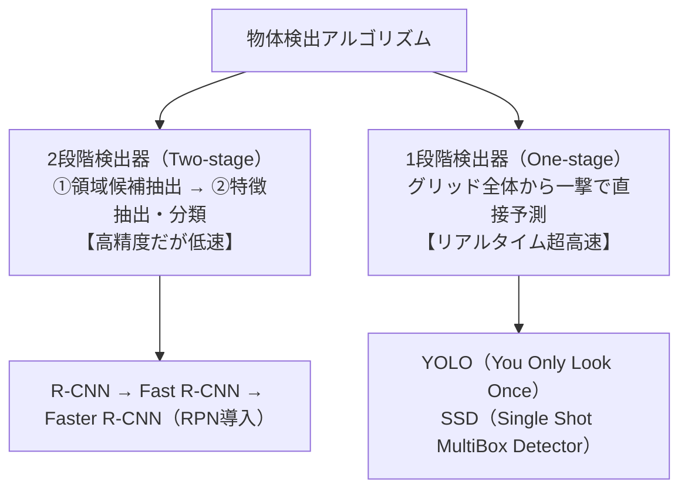

# 第6章：画像認識・CNN・物体検出（計算問題完全攻略）

## 6-1. CNNの構造と手計算公式（合否を分ける計算問題）（Q246..Q255）

畳み込みニューラルネットワーク（CNN: Convolutional Neural Network）は、画像の空間的構造（局所的な相関関係）を保ったまま特徴抽出を行うディープラーニングモデルです。

### 【必勝】CNN出力サイズ計算公式
入力画像の幅（または高さ）を $W$、カーネル（フィルタ）サイズを $K$、パディング幅を $P$、ストライドを $S$ としたとき、出力特徴マップのサイズ $O$ は：
$$O = \left\lfloor \frac{W - K + 2P}{S} \right\rfloor + 1$$

> **計算例（G検定過去問頻出パターン）**:
> 1. **基本パディングなし**: 入力 $32 \times 32$、カーネル $5 \times 5$、パディング $0$、ストライド $1$:
>    $$O = \frac{32 - 5 + 2(0)}{1} + 1 = 27 + 1 = 28 \implies \mathbf{28 \times 28}$$
> 2. **サイズ半減（ダウンサンプリング）**: 入力 $64 \times 64$、カーネル $3 \times 3$、パディング $1$、ストライド $2$:
>    $$O = \frac{64 - 3 + 2(1)}{2} + 1 = \frac{63}{2} + 1 = 31.5 + 1 \to \mathbf{32 \times 32}$$

### 【必勝】畳み込み層のパラメータ数計算公式
$$\text{総パラメータ数} = (K_h \times K_w \times C_{in} + 1) \times C_{out}$$
- $K_h, K_w$: カーネルの高さと幅
- $C_{in}$: 入力チャネル数
- $+1$: バイアス項（各出力チャネルに1つ存在）
- $C_{out}$: 出力チャネル数（フィルタの総数）

> **計算例**: 入力チャネル $3$、出力チャネル $16$、カーネル $3 \times 3$ のとき：
> $$(3 \times 3 \times 3 + 1) \times 16 = (27 + 1) \times 16 = 28 \times 16 = \mathbf{448 \text{ 個}}$$

### 【超重要トラップ】プーリング層のパラメータ数
- プーリング層（Max Pooling, Average Pooling）は、局所領域の最大値や平均値を取る固定の決定論的演算を行う層です。
- **学習すべきパラメータ数は「0（ゼロ）」**です。試験の選択肢で数千個などのダミー数値に騙されないこと！
- **Global Average Pooling（GAP）**: 各特徴マップ全体の平均値を計算して1つの数値に集約する手法。全結合層を置き換えることで、**モデルの総パラメータ数を劇的に削減し過学習を根絶**します。

---

## 6-2. 代表的CNNアーキテクチャの系譜（Q256..Q270）

| モデル名 | 層数・年代 | 最大の技術的革新 | G検定での最重要キーワード |
| :--- | :---: | :--- | :--- |
| **LeNet** | 5層 (1998) | ヤン・ルカン提唱。畳み込みとサブサンプリングの組み合わせ | MNIST手書き数字認識 |
| **AlexNet** | 8層 (2012) | Alex Krizhevsky提唱。ILSVRC 2012で2位に大差をつけて優勝 | **ReLU, Dropout, Local Response Normalization, GPU並列学習** |
| **VGGNet** | 16/19層 (2014) | オックスフォード大学。大きなカーネル（5×5や7×7）を廃止し、**$3 \times 3$ の小さなカーネルを多層に重ねる** | 受容野を保ったまま非線形性を高め、パラメータ数を削減 |
| **GoogLeNet** | 22層 (2014) | **Inceptionモジュール**（異なるサイズ $1\times 1, 3\times 3, 5\times 5$ の並列処理） | **$1 \times 1$ 畳み込みによる次元削減（ボトルネック）**、Auxiliary Loss（補助分類器） |
| **ResNet** | 152層 (2015) | カイミング・ヒーら提唱。**スキップ接続（残差接続: Shortcut Connection）** | 目標写像 $H(x)$ ではなく残差 $F(x) = H(x) - x$ を学習。**勾配消失を防ぎ100層以上の深層化を世界で初めて達成** |
| **Vision Transformer (ViT)** | (2020) | 画像を $16 \times 16$ のパッチに分割し、線形射影してTransformerに入力 | **局所的な帰納バイアス（Inductive Bias）を持たない**ため、超巨大データ事前学習で真価を発揮 |

---

## 6-3. 物体検出（Object Detection）とセグメンテーション（Q271..Q285）

画像内の「何が（分類: Classification）」「どこに（位置特定: Bounding Box回帰）」あるかを同時に解くタスク。

### 物体検出の重要概念と評価指標
- **IoU（Intersection over Union）**:
  予測バウンディングボックス $A$ と正解ボックス $B$ の重なり度合い。
  $$\text{IoU} = \frac{\text{Area}(A \cap B)}{\text{Area}(A \cup B)}$$
  - 通常、IoU $\ge 0.5$ で検出成功（TP）とみなす。
- **NMS（Non-Maximum Suppression: 非極大値抑制）**:
  同一の物体に対して出力された多数の重複する候補枠の中から、最も信頼度の高い枠を残して他を削除する後処理アルゴリズム。
- **mAP（Mean Average Precision）**:
  クラスごとのPR曲線下の面積（AP）を計算し、全クラスで平均した総合精度指標。

### セマンティックセグメンテーション（画像領域分割）
画像内のすべてのピクセルに対して1つずつクラスラベルを付与するタスク。
- **FCN（Fully Convolutional Network）**: 全結合層をすべて畳み込み層に置き換え、任意の画像サイズを入力可能にし、転置畳み込み（Deconvolution）で解像度を復元。
- **U-Net**: エンコーダ（縮小パス）とデコーダ（拡大パス）の間を**スキップ接続で直接結ぶ**ことで、高解像度のエッジ・位置情報を損なわずに復元するアーキテクチャ。医療画像診断で広く普及。

---

## 6-4. 3D認識・点群・画像キャプション・Vision Transformer・NeRF（Q286..Q305）

画像認識（2D）を超えて空間・点群・視覚言語・新視点合成へと拡張された最新コンピュータビジョン領域です。

### 3D点群処理（PointNet / PointNet++）（Q286..Q290）
- **課題**: 点群データ（Point Cloud）は順不同であり、回転や平行移動に対する不変性が求められる。
- **PointNet**: 各点に対して共通の多層パーセプトロン（MLP）を適用後、**対称関数（Symmetric Function）であるMax Pooling**を用いて点群全体のグローバル特徴を抽出。点の入力順序に依存しないアーキテクチャを実現。
- **PointNet++**: 局所的な階層構造を捉えるため、近傍の点群をサンプリング・グルーピングして局所特徴を段階的に集約。

### 画像キャプショニングとマルチモーダル（Q291..Q295）
- **Show and Tell**: 画像特徴をCNNで抽出し、その特徴ベクトルをRNN/LSTMの初期状態として与えて文章を逐次生成（Encoder-Decoderモデル）。
- **Show, Attend and Tell**: 単語を生成するごとに、画像のどの領域に着目すべきかを算出する**ソフト/ハード・アテンション機構**を導入し、説明精度を大幅に向上。

### セグメンテーションの発展（Q296..Q300）
- **Semantic Segmentation**: ピクセルごとにクラス（人、車、道路）を予測。個体の区別はしない（FCN, U-Net, DeepLab）。
- **Instance Segmentation**: 物体検出＋セグメンテーション。同じ「人」クラスでも個体A、個体Bを別々にマスク分割（Mask R-CNN）。
- **Panoptic Segmentation（全景セグメンテーション）**: 背景（Stuff: 道路・空など）のセマンティック分割と、前景物体（Thing: 人・車など）のインスタンス分割を統一的に統合。

### Vision Transformer（ViT）とNeRF（Q301..Q305）
- **Vision Transformer (ViT, 2020)**: 画像を $16 \times 16$ などの固定サイズパッチに分割し、線形射影してパッチ埋め込み（Patch Embedding）を作成。位置エンコーディングを加えて標準的なTransformer Encoderに入力。畳み込みの帰納バイアス（Inductive Bias）が少ないため、超大規模データセットでの事前学習でCNNを凌駕する性能を達成。
- **Swin Transformer**: 画像解像度に対して線形な計算量を実現するため、局所的なウィンドウ内でSelf-Attentionを計算し、層が深くなるにつれてウィンドウをシフト（Shifted Window）して階層的に特徴を統合。
- **NeRF (Neural Radiance Fields, 2020)**: 複数視点から撮影された2D画像から、空間の3D座標 $(x, y, z)$ と視線方向 $(\theta, \phi)$ を5次元入力とし、多層パーセプトロン（MLP）でRGBカラーと体積密度（Volume Density）を予測。ボリュームレンダリングを通じて自由視点からの超高精細な新視点画像を合成する技術。
