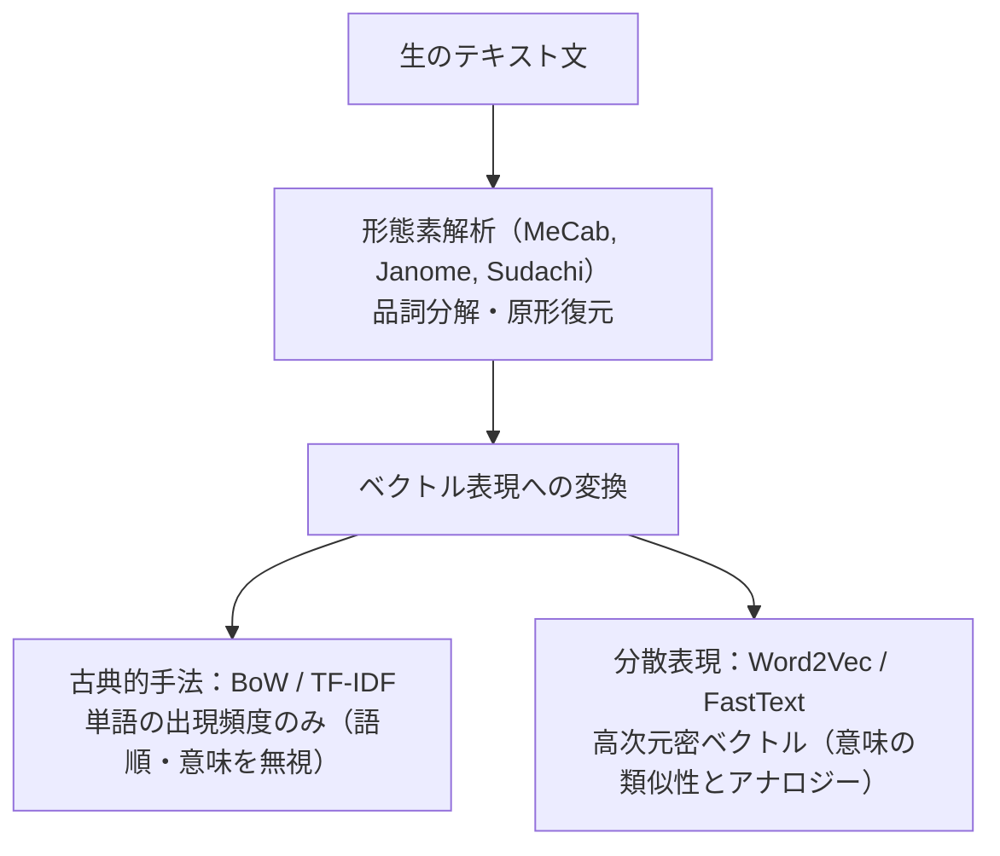
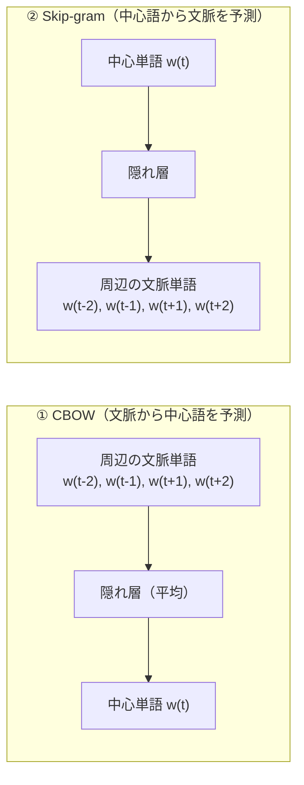
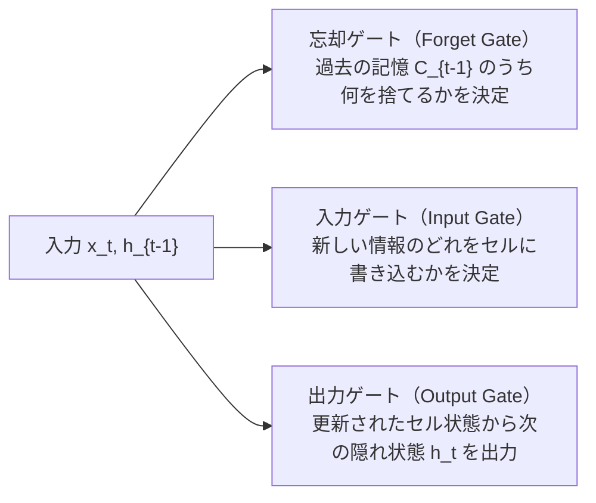
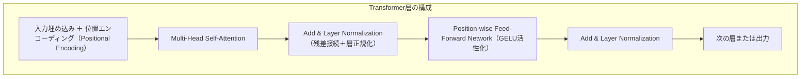
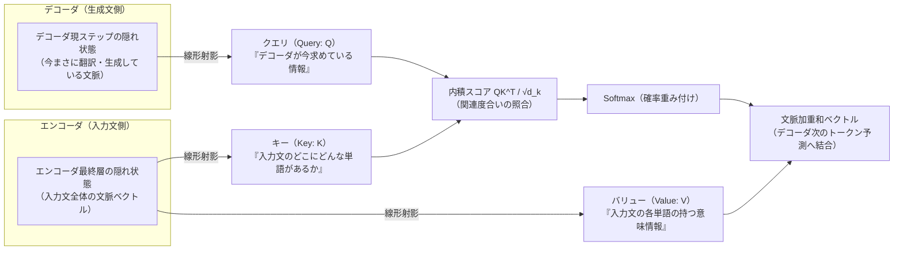
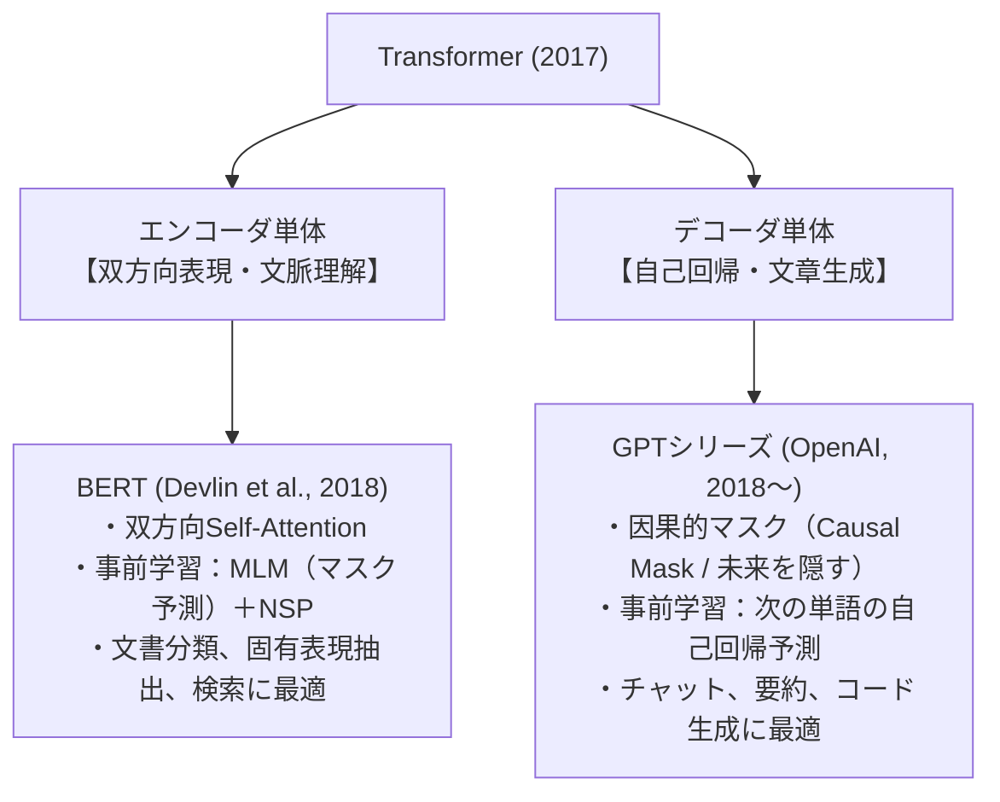
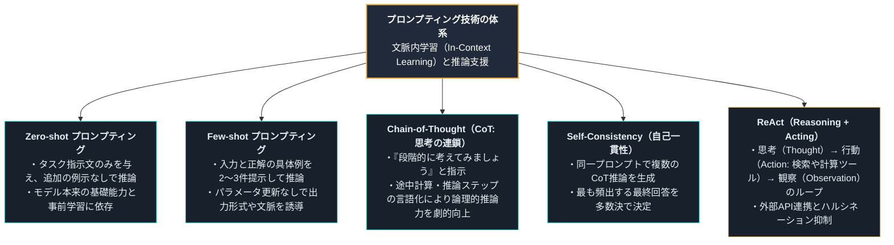
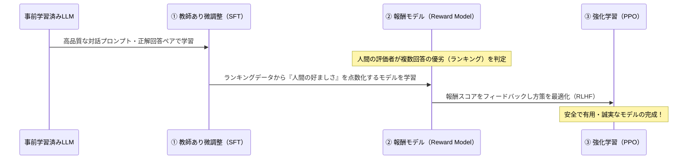
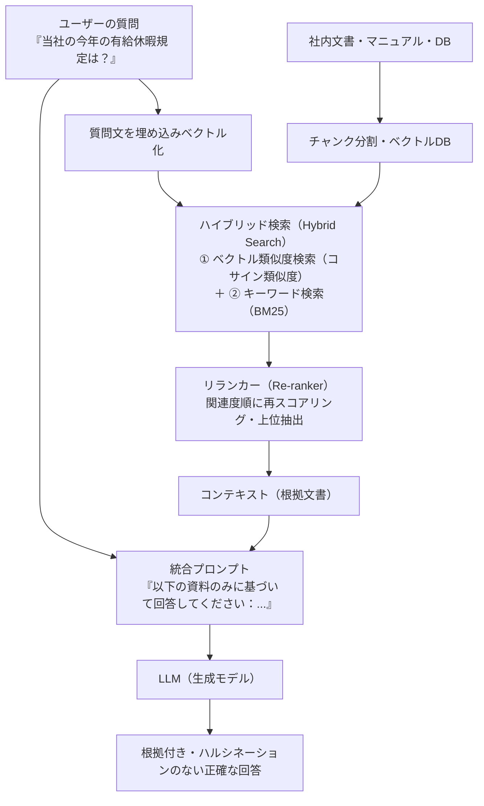

# 第7章：自然言語処理・Transformer・LLM（現代AIの核心）

## 7-1. 自然言語処理の基礎と単語分散表現（Q306..Q320）

### TF-IDF（単語の重要度スコア計算）
文書群の中で特定の単語がどれだけ重要で特徴的かを評価する指標。
$$\text{TF-IDF}(t, d, D) = \text{TF}(t, d) \times \text{IDF}(t, D)$$
- **TF（Term Frequency）**: 文書 $d$ 内における単語 $t$ の出現頻度。
- **IDF（Inverse Document Frequency）**: 全文書数 $N$ を単語 $t$ が出現する文書数 $\text{DF}(t)$ で割った対数。
  $$\text{IDF}(t, D) = \log \frac{N}{\text{DF}(t)}$$
  - 「て・に・を・は」のようにすべての文書に現れる単語は IDF が $0$ に近づき、特定の文書にしか現れない専門用語は IDF が跳ね上がる。

### 分布仮説（Distributional Hypothesis）とWord2Vec
言語学者ジョン・ルパート・ファース（J.R. Firth）の**「単語の意味は、その周辺の単語によって決まる」**という分布仮説に基づき、トマス・ミコロフらが2013年に提案した単語埋め込み手法。

| 比較項目 | CBOW (Continuous Bag-of-Words) | Skip-gram |
| :--- | :--- | :--- |
| **予測方向** | 周囲の文脈単語 $\to$ **中心単語を予測** | 中心単語 $\to$ **周囲の文脈単語を予測** |
| **計算速度** | **高速**（文脈ベクトルを平均して処理） | 相対的に低速（予測回数が多い） |
| **単語適性** | 高頻度語の学習に適している | **低頻度語（珍しい単語）の表現力に優れる** |
| **アナロジー演算** | ベクトルの加減算が可能（$\vec{\text{King}} - \vec{\text{Man}} + \vec{\text{Woman}} \approx \vec{\text{Queen}}$） |
| **高速化技法** | **ネガティブサンプリング（Negative Sampling）**: 全語彙のソフトマックス分母計算を避け、数個の偽単語（負例）との2値分類に落とし込む手法 |

---

## 7-2. 系列モデルの進化（RNN $\to$ LSTM $\to$ Seq2Seq）（Q321..Q325）

### RNN（リカレントニューラルネットワーク）の限界
隠れ状態 $h_t = \tanh(W_{hh} h_{t-1} + W_{xh} x_t)$ を時系列方向にループさせる構造。
- **弱点**: 系列長が長くなると、時間の逆伝播（BPTT: Backpropagation Through Time）において勾配消失または勾配爆発が発生し、**長い過去の文脈を記憶できない（長期依存性の破綻）**。

### LSTM（Long Short-Term Memory, 1997）
セル状態 $C_t$（情報の高速道路）と3つのゲート機構によって長期記憶を可能にしたモデル。

---

## 7-3. Transformerアーキテクチャの完全解剖（Q326..Q340）

2017年にGoogleの研究チーム（Vaswani et al.）が発表した論文『Attention Is All You Need』によって登場した、現代AIの基盤構造です。RNNのような再帰構造を完全に撤廃し、**自己注意機構（Self-Attention）のみ**で系列全体を並列処理します。

### Self-Attention（自己注意機構）の数理
$$\text{Attention}(Q, K, V) = \text{softmax}\left( \frac{Q K^T}{\sqrt{d_k}} \right) V$$
- **クエリ $Q$（Query）**: 「何を探しているか」を表す検索ベクトル。
- **キー $K$（Key）**: 「どんな内容を持っているか」を表すインデックスベクトル。
- **バリュー $V$（Value）**: 「実際の情報の中身」を表す値ベクトル。
- **$\sqrt{d_k}$ で割る理由（Scaled Dot-Product）**:
  次元数 $d_k$ が大きくなると内積の値が極端に巨大化し、ソフトマックス関数の勾配が極小化（飽和）して学習が停滞するため、分散を $1$ にスケーリングして勾配消失を防ぐ。
- **計算量とメモリ消費量**:
  系列長（トークン数）を $N$ としたとき、全トークン同士のペア（$N \times N$）を一度に計算するため、計算量およびメモリ消費量は **$O(N^2)$（系列長の二乗に比例）**となる。

### Encoder-Decoder Attention（Cross-Attention）の構造と役割
新シラバス（G2024#6）で出題が強化された、機械翻訳やSeq2Seq（T5など）における核心メカニズムです。

| 比較項目 | Self-Attention（自己注意） | Encoder-Decoder Attention（Cross-Attention） |
| :--- | :--- | :--- |
| **Query ($Q$) の供給元** | **自分自身の入力系列**（エンコーダまたはデコーダ） | **デコーダ側**（現在生成中の系列） |
| **Key ($K$) の供給元** | **自分自身の入力系列** | **エンコーダ側**（入力文・原文の最終出力） |
| **Value ($V$) の供給元** | **自分自身の入力系列** | **エンコーダ側**（入力文・原文の最終出力） |
| **機能・目的** | 文中の単語同士の依存関係・文脈を把握する | 原文のどの単語に注目して次の単語を生成すべきか照合する |

---

## 7-4. BERT vs GPT：基盤モデルの2大潮流（Q341..Q350）

| 比較項目 | BERT (Bidirectional Encoder) | GPT (Generative Pre-trained Transformer) |
| :--- | :--- | :--- |
| **ベース構造** | Transformerの**エンコーダ** | Transformerの**デコーダ** |
| **注意の向き** | **双方向（前後の文脈を同時に参照）** | **片方向（左から右への自己回帰的マスク）** |
| **事前学習タスク** | **MLM（Masked LM: 15%をマスクして穴埋め）** ＋ **NSP（次文予測）** | **Next Token Prediction（次の単語を自己回帰予測）** |
| **得意領域** | 文書分類、感情分析、質問応答、意味検索 | 対話生成、文章作成、コード生成、翻訳 |

---

## 7-5. LLMの進化・プロンプティング・微調整・アライメント（Q351..Q375）

### スケーリング則（Scaling Laws）と創発的能力
- **Kaplan則 vs Chinchilla則（DeepMind）**:
  計算予算（Compute）が与えられたとき、モデルパラメータ数 $N$ と事前学習トークン数 $D$ を**同等の比率（等比級数的）でバランスよく拡大**することが最適解である（パラメータだけを巨大化してデータが不足していると未学習になる）。
- **創発的能力（Emergent Abilities）**:
  ある一定のパラメータ規模（通常数億〜数十億パラメータ以上）を突破した瞬間に、事前の明示的な学習なしに突然発現する高度な推論力、算術能力、文脈内学習能力。

### プロンプティング技術の体系

### PEFT（パラメータ効率的ファインチューニング）
モデル全体の全パラメータを更新する「フルファインチューニング」は巨大なGPUメモリを消費するため、少数の追加パラメータのみを更新する技術が必須となりました。

- **LoRA（Low-Rank Adaptation）**:
  元の重み行列 $W \in \mathbb{R}^{d \times k}$ を完全に凍結したまま、低ランク行列 $B \in \mathbb{R}^{d \times r}$ と $A \in \mathbb{R}^{r \times k}$（ランク $r \ll \min(d, k)$）の積 $\Delta W = B \times A$ のみを学習させる。学習パラメータ数を元の 0.1% 以下に削減可能。
- **QLoRA**:
  元のモデル重みを 4-bit NormalFloat (NF4) に量子化し、メモリを極限まで節約しつつ LoRA のみを高精度学習する手法。家庭用GPU1枚で数十億パラメータのモデルを調整可能。

### アライメント（安全性・有用性の調整）

- **DPO（Direct Preference Optimization）**: 報酬モデルを明示的に挟むことなく、人間の選好データ（好ましい回答 vs 好ましくない回答）から直接数理的にLLMを最適化する最新の簡略手法。

---

## 7-6. RAG（検索拡張生成）の構造と実装（Q376..Q385）

LLMの2大弱点である「最新情報の欠落」と「ハルシネーション（嘘の生成）」を解消する最重要ソリューション。

---
