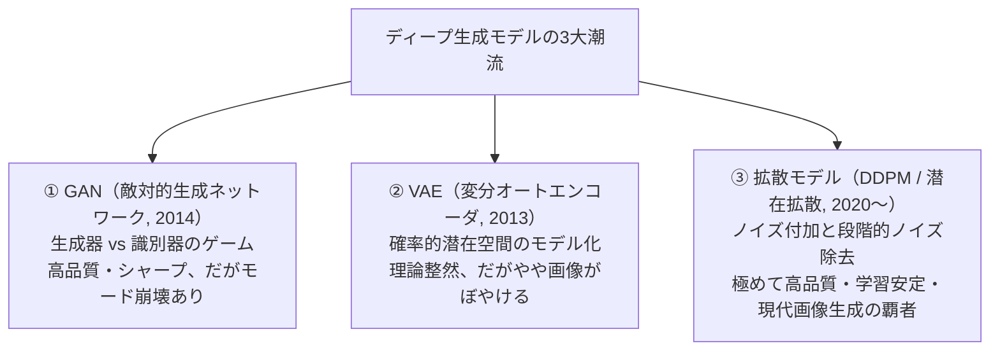
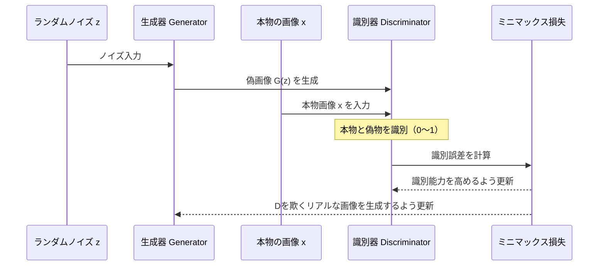
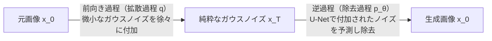
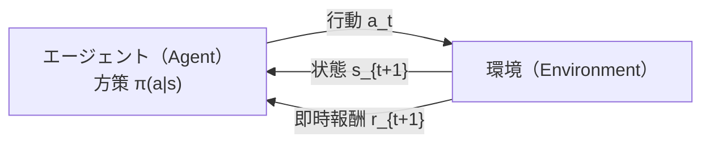
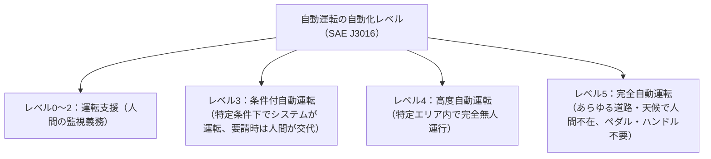

# 第8章：生成AI・強化学習・自律システム・最新動向

## 8-1. 生成モデルの系譜（GAN・VAE・拡散モデル）（Q386..Q400）

ディープラーニングにおける生成モデルは、訓練データの確率分布 $p_{\text{data}}(x)$ を学習し、そこから未知の新しいリアルなデータをサンプリング生成する技術です。

### GAN（敵対的生成ネットワーク: Generative Adversarial Networks）
イアン・グッドフェロー（Ian Goodfellow）らが2014年に提唱したモデル。

- **目的関数（ミニマックスゲーム）**:
  $$\min_G \max_D V(D, G) = \mathbb{E}_{x \sim p_{\text{data}}}[\log D(x)] + \mathbb{E}_{z \sim p_z}[\log (1 - D(G(z)))]$$
- **モード崩壊（Mode Collapse）**:
  生成器 $G$ が、識別器 $D$ を欺きやすい「特定の限定されたパターン（例：数字の8ばかり）」のみを繰り返し生成し、データの多様性が失われてしまうGAN特有の典型的な欠点。
- **派生アーキテクチャ**:
  - **DCGAN**: 畳み込み層を取り入れたガイドライン（全結合層の排除、転置畳み込み、BN導入）。
  - **Pix2Pix**: ペア（正解対応関係）のある画像間変換（線画 $\to$ 写真）。
  - **CycleGAN**: **ペアのない画像群同士の変換**（馬 $\leftrightarrow$ シマウマ）。**サイクル一貫性損失（Cycle Consistency Loss: $A \to B \to A$ で元に戻る制約）**を導入。
  - **StyleGAN**: 潜在変数を中間潜在空間 $\mathcal{W}$ に写像し、Adaptive Instance Normalization (AdaIN) を通じて解像度ごとの「スタイル（髪型、表情、質感）」を制御。

### VAE（変分オートエンコーダ: Variational Autoencoder）
- 通常のオートエンコーダが潜在空間上の1点に圧縮するのに対し、VAEは**潜在変数の確率分布（平均 $\mu$ と分散 $\sigma^2$）**を出力する。
- **リパラメタライゼーション・トリック（Reparameterization Trick）**:
  分布から直接サンプリングすると乱数発生処理が挟まり逆伝播（微分の連鎖律）が途切れてしまうため、外部の標準正規乱数 $\epsilon \sim \mathcal{N}(0, I)$ を用いて $z = \mu + \sigma \odot \epsilon$ と変形することで、パラメータ $\mu, \sigma$ に対する誤差逆伝播を可能にした画期的テクニック。

### 拡散モデル（Diffusion Models）と潜在拡散モデル（LDM）
現代のMidjourney、Stable Diffusionなどの心臓部。

- **潜在拡散モデル（Latent Diffusion Model: LDM / Stable Diffusion）**:
  高解像度のピクセル空間で直接拡散・ノイズ除去を行うとGPU計算量が天文学的になるため、**事前に事前学習したオートエンコーダ（VAE）を用いて低次元の潜在空間に圧縮し、潜在空間上で拡散過程を実行**することで劇的な高速化と省メモリ化を達成。
  テキスト条件付けにはCLIPのテキストエンコーダとCross-Attentionを使用。
- **Diffusion Transformer (DiT)**:
  ノイズ予測のバックボーンを従来のU-NetからTransformerアーキテクチャに置換した最新構造。OpenAIの動画生成モデル「Sora」などで採用。

### マルチモーダル基盤モデルと対照学習（CLIP）
テキストと画像を横断して理解・生成を行うマルチモーダルAIの根幹技術です。
- **CLIP（Contrastive Language-Image Pre-training / OpenAI, 2021）**:
  - インターネット上の4億組の「画像とキャプション（テキスト）」のペアを学習。
  - **画像エンコーダ（Vision Transformer等）** と **テキストエンコーダ（Transformer）** を並列に配置。
  - **対照学習（Contrastive Learning）**: 正しいペア（対角成分）のコサイン類似度を最大化し、無関係なペアの類似度を最小化するように学習。
  - 画像とテキストを**同一の共通埋め込み空間**へ写像することで、追加学習なしに未知の物体を分類できる「ゼロショット画像分類（Zero-Shot Classification）」や、Stable Diffusionのプロンプト解釈器として不可欠。

---

## 8-2. 強化学習（Reinforcement Learning）の基礎と深層化（Q401..Q420）

試行錯誤を通じて、エージェントが環境から得られる「累積報酬（Return）」を最大化する方策（Policy）を学習する枠組み。

### マルコフ決定プロセス（MDP）と割引報酬和
- **マルコフ性**: 次の状態 $s_{t+1}$ と報酬 $r_{t+1}$ は、現在の状態 $s_t$ と行動 $a_t$ のみに依存し、過去のすべての履歴には依存しないという性質。
- **割引累積報酬 $G_t$**:
  $$G_t = \sum_{k=0}^{\infty} \gamma^k r_{t+k+1} = r_{t+1} + \gamma r_{t+2} + \gamma^2 r_{t+3} + \dots$$
  - $\gamma$（割引率, $0 \le \gamma \le 1$）: 将来得られる報酬の現在価値への割り引き。
    - $\gamma = 0$: 直後の即時報酬のみを重視する極度の近視眼的行動。
    - $\gamma \to 1$: 遠い将来に得られる大きな報酬まで見越した長期的な行動。

### 探索と利用のトレードオフ（Exploration vs Exploitation）
- **利用（Exploitation）**: 現時点で最も高い報酬が得られると分かっている最善の行動をとる。
- **探索（Exploration）**: まだ試していない未知の行動を試して、より優れた報酬を探す。
- **$\epsilon$-greedy（イプシロン・グリーディ）法**: 確率 $1 - \epsilon$ で現在の最善手（利用）を選び、確率 $\epsilon$ でランダムな行動（探索）を選択する。

### Q学習 vs SARSA
| アルゴリズム | 方策の性質 | Q値の更新目標（ターゲット） | 特徴 |
| :--- | :--- | :--- | :--- |
| **Q学習 (Q-Learning)** | **オフポリシー (Off-policy)** | $\max_{a'} Q(s', a')$（次の状態で最も高いQ値） | 実際にとる行動に関係なく貪欲に最適方策を学習 |
| **SARSA** | **オンポリシー (On-policy)** | $Q(s', a')$（**実際に選択した次の行動 $a'$ のQ値**） | 現在の方策で実際に動いた結果に基づいて安全側に学習 |

### 深層強化学習（Deep Q-Network: DQN, 2015）
ニューラルネットワークでQ関数 $Q(s, a; \theta)$ を近似。Atariのビデオゲームを人間超えでプレイして世界に衝撃を与えた。
- **Experience Replay（経験再生）**: エージェントの遷移データ $(s, a, r, s')$ をメモリバッファに保存し、ランダムにサンプリングしてミニバッチ学習。連続データ間の強い相関を断ち切り学習を安定化。
- **Target Network（ターゲットネットワーク）**: 目標Q値を計算するネットワークのパラメータを一時的に固定し、更新対象のネットワークと分離することで発散を防止。

---

## 8-3. 自律システム・ロボティクス・新興AI動向（Q421..Q440）

| 先端動向 | 概要・革新性 | 代表例 / 受賞歴 |
| :--- | :--- | :--- |
| **AlphaFold** | アミノ酸配列からタンパク質の3次元立体構造を超高精度で予測。創薬・生命科学に革命 | **2024年 ノーベル化学賞受賞**（デミス・ハサビス、ジョン・ジャンパー） |
| **VLA (Vision-Language-Action)** | 画像認識・言語理解・ロボット制御を統合し、自然言語指示からロボットアームの動作をEnd-to-End生成 | Google DeepMind「RT-1」「RT-2」 |
| **世界モデル (World Models)** | 観測データから環境の物理法則・シミュレータを内部に学習し、「夢（シミュレーション）の中」で行動計画 | Yann LeCunのJEPA、Soraの基底概念 |
| **自律型AIエージェント** | 外部ツール（Web検索、Python実行、ファイル操作）を自律的に呼び出して複雑タスクを完遂 | AutoGPT, Devin, ReActフレームワーク |

---
