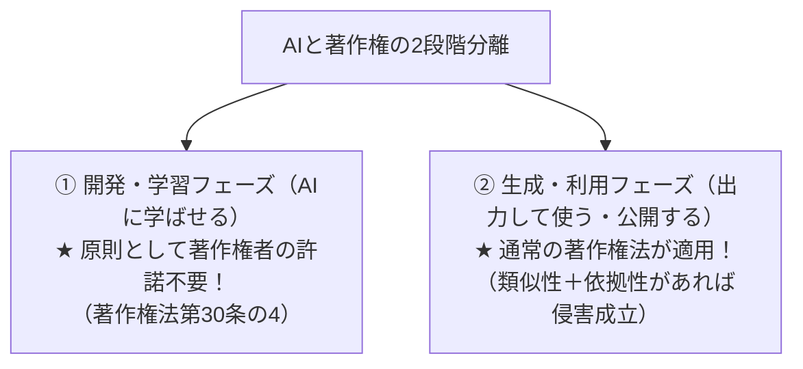
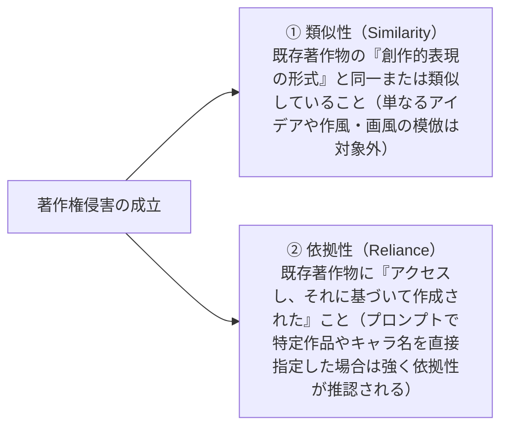
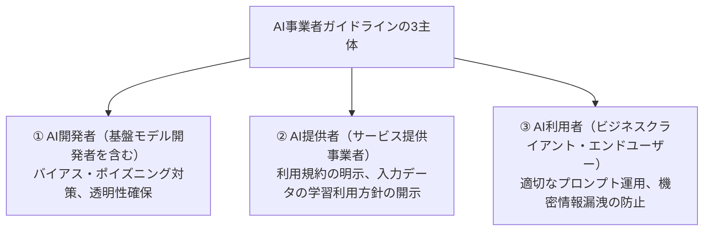
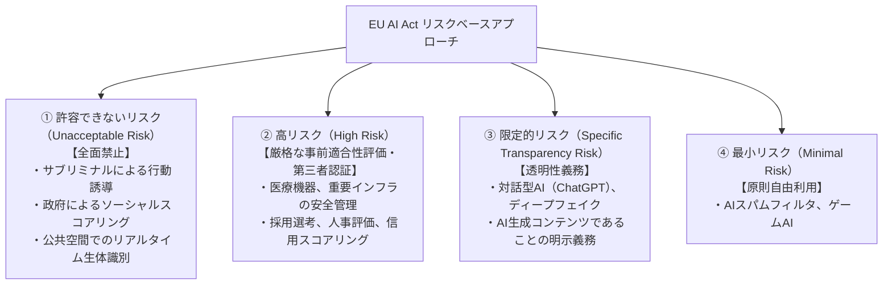
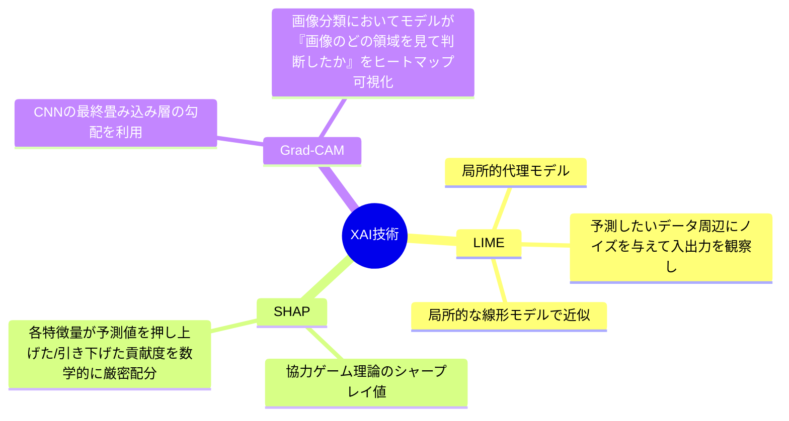
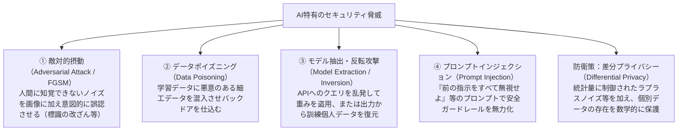
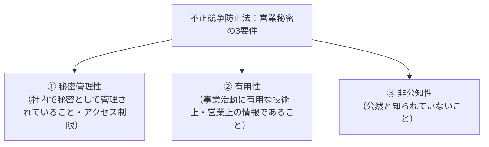

# 第9章：AI倫理・法規制・ガバナンス・セキュリティ（合否の分水嶺）

近年のG検定において、**最も出題比率が高く、かつ法改正・ガイドライン策定が相次いでいる最重要分野**です。

---

## 9-1. 日本の著作権法とAI（開発・学習フェーズ vs 生成・利用フェーズ）（Q441..Q455）

日本の著作権法は、2018年改正により世界で最も「AI開発・学習にオープンで寛容な法制（マシンパラダイス）」と評されてきましたが、生成AIの普及に伴い、2024年3月に文化庁から**「AIと著作権に関する考え方について」**が取りまとめられ、厳格な解釈基準が示されました。

### 著作権法第30条の4（情報解析のための利用）の完全整理
> **第30条の4本文**: 「思想又は感情を自ら享受し又は他人に享受させることを目的としない場合」は、必要と認められる限度において、著作物の複製・翻案・学習データとしての利用が**無許諾で行える**。

| 観点 | 許諾不要（30条の4適用）のケース | 許諾が必要（侵害・違法）となるケース |
| :--- | :--- | :--- |
| **利用目的** | **非享受目的（情報解析・学習）**：パターンの抽出、重みパラメータの最適化 | **享受目的の併存**：作風や表現そのものを鑑賞・味わう目的が含まれる場合 |
| **商用・非商用** | **営利企業による商用AI開発でも無許諾で可能！**（商用・非商用は問わない） | 営利・非営利を問わず、享受目的があれば無許諾は違法 |
| **ただし書の適用除外** | 通常のWebスクレイピング、公開データの学習利用 | **著作権者の利益を不当に害することとなる場合**： ① データ解析用として販売されている市販データベースを無断複製 ② 海賊版サイトと知りながら大量スクレイピング ③ 特定作家の作風を意図的に模倣・代替するLoRA学習 |

### 生成・利用フェーズにおける著作権侵害の2大要件
AI生成物が既存の著作権を侵害したと認定されるためには、従来の著作権侵害と**全く同じ2つの要件**を同時に満たす必要があります。

### AI生成物の「著作物性」（権利は誰にあるか？）
- **原則（著作権なし）**: 単に「美しい風景を描いて」と短いプロンプトを入力してAIが自動生成した画像は、人間が創作したとは認められず「著作物」になりません（誰も著作権を持たないパブリックドメインに近い扱い）。
- **例外（著作物として保護）**: 人間が詳細なプロンプトの試行錯誤、複数回のパラメータ調整、構図の指定、生成後のペイントソフトによる加筆・修正などを通じて、**「人間による創作的意図および創作的寄与」**が認められる場合には、その人間の著作物として認められます。

---

## 9-2. 知的所有権・関連法規（特許法・個人情報・PL法）（Q456..Q465）

| 法律名 | AIに関する最重要論点 | G検定での頻出ポイント |
| :--- | :--- | :--- |
| **特許法** | 発明者の定義 | 特許法上の「発明者」は**自然人（生身の人間）に限られる**。AIそのものを発明者として記載した特許出願は却下される（**DABUS事件**）。 |
| **不正競争防止法** | 営業秘密と限定提供データ | 秘密管理された技術情報（営業秘密）の保護に加え、ID・パスワード等で管理され特定の相手に提供される電磁的データ（**限定提供データ**）の不正取得・利用を禁止。 |
| **個人情報保護法** | 要配慮個人情報と加工情報 | ① **要配慮個人情報**（病歴・人種・信条等）は原則として**本人の事前同意**が必須。 ② **仮名加工情報**: 内部分析に限り目的変更が可能だが、**原則第三者提供は禁止**。 ③ **匿名加工情報**: 復元不可能な加工により、**本人の同意なく第三者提供可能**。 |
| **製造物責任法 (PL法)** | ソフトウェア単体とAI組込製品 | PL法の対象は「製造又は加工された**動産（有体物）**」に限られる。したがって、スタンドアロンのAIソフトウェア単体には原則PL法は適用されないが、**AIが組み込まれた自動車やロボットなどの動産製品に欠陥があった場合、製造業者は無過失責任を負う**。 |

---

## 9-3. AI事業者ガイドライン（2024年4月策定）とEU AI Act（Q466..Q485）

### 総務省・経済産業省「AI事業者ガイドライン（第1.0版, 2024年4月）」
従来の「AI開発ガイドライン」「AI利活用ガイドライン」等を統合・刷新した日本の国家指針。

- **共通の10原則**: 人間中心、安全性、公平性、プライバシー保護、セキュリティ確保、透明性・説明責任、教育・リテラシーなど。

### 欧州連合「EU AI Act（EU人工知能規則）」の4層リスク規制
世界で初めて法制化された包括的AI規制法。違反時の制裁金は**最大3,500万ユーロ（約57億円）または全世界売上高の7%のいずれか高い方**という超厳罰主義を採用。

### 広島AIプロセスと国際ガバナンス
- **広島AIプロセス（Hiroshima AI Process, 2023〜2024）**:
  - 2023年5月のG7広島サミットで合意された、生成AIに関する世界初の包括的な国際行動規範・国際指針。
  - 偽情報（ディープフェイク）の拡散防止、知的財産権の尊重、高度な基盤モデルに対する脆弱性検証（レッドチーミング）などを規定。

### AIガバナンスにおける人間の関与レベル（Human-in/on-the-loop）
自動意思決定における人間の責任・介在の度合いを示す最重要分類概念です。
1. **Human-in-the-loop (HITL)**: AIは提案・候補提示にとどまり、**最終決定・実行は必ず人間が行う**（例：医療診断支援、融資可否の最終承認）。
2. **Human-on-the-loop (HOTL)**: AIが自律的に実行するが、**人間が常時監視し、異常時に緊急停止や介入（オーバーライド）を行える**（例：高度自動運転レベル3〜4、工場の自律制御）。
3. **Human-in-command (HIC)**: システム全体の目的設定、稼働・停止、法的責任を人間が包括的に監督・統制する。

---

## 9-4. AI倫理・公平性・説明可能性・セキュリティ（Q486..Q500）

### バイアスと公平性のジレンマ
- **COMPAS事件**: 米国の裁判所で再犯リスクを予測するAIが、黒人被告に対して白人被告よりも「偽陽性率（再犯しないのに高リスクと誤判定）」が約2倍高かった問題。
- **代理変数（Proxy Variable）の罠**: 学習データから人種や性別のラベルを単純に除外しても、郵便番号（居住区）、出身校、閲覧履歴などの「代理変数」を通じてAIが間接的に差別を学習してしまう現象。

### 説明可能AI（XAI: Explainable AI）の3大手技
ブラックボックス化しやすい深層学習モデルの判断根拠を可視化する技術。

### AIセキュリティの5大脅威

---

## 9-5. AIビジネス・契約実務・営業秘密（Q486..Q500）

AIモデルを企業間取引や受託開発で実装する際に必須となる法務実務です。

| 契約・実務項目 | 主な論点と経済産業省ガイドライン | G検定での最重要ポイント |
| :--- | :--- | :--- |
| **営業秘密の3要件** | 不正競争防止法第2条第6項 | ① **秘密管理性**（マル秘表示、アクセス権限管理）、② **有用性**（事業価値がある）、③ **非公知性**（世間に知られていない）。この3つを全て満たさないと法律上の営業秘密として保護されない |
| **AI開発委託契約の特性** | 従来のウォーターフォール開発 vs **アジャイル・探索型契約** | AI開発は「事前に100%の精度保証（瑕疵担保・契約不適合責任）ができない」という不確実性（ブラックボックス性）を持つ。そのため、段階的（PoC $\to$ 本開発）に契約を締結し、**請負契約ではなく準委任契約**を基本とする |
| **知的財産権の帰属** | 学習データ、ノウハウ、学習済みモデルの権利分配 | ・提供データ：原則としてユーザー（発注者）に帰属 ・学習済みモデル：ノウハウの再利用を確保するためベンダー（受注者）が共有または非独占利用権を確保することが多い |
| **外部AIサービスの利用規約** | 生成AI（ChatGPT等）のAPI利用とWebブラウザ利用の違い | 商用利用の可否、入力プロンプトがモデルの追加学習に利用（オプトイン/オプトアウト）されるかどうかの規約確認が最重要（API経由は通常学習除外） |

---
